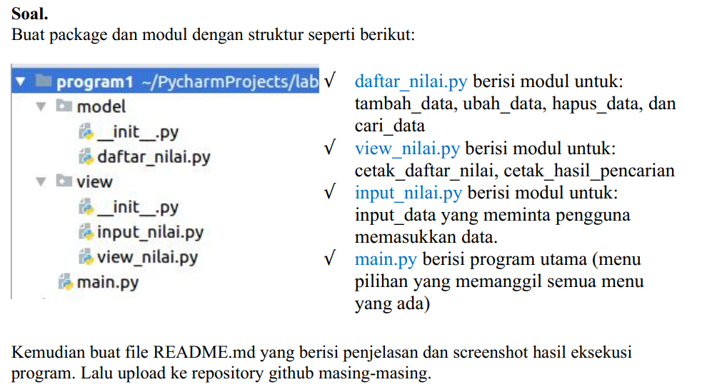

# Ujian Akhir Semester 1 - Bahasa Pemrograman - Repository: uas-smt1-upb
<hr>

Repository ini dibuat untuk memenuhi UAS Semester 1 - Bahasa Pemrograman.
<br>

Saat ini saya sedang mengerjakan Ujian Akhir Semester 1 - Program Studi Bahasa Pemrograman - Teknik Informatika - Univeristas Pelita Bangsa.<br>
* Untuk ujian kali ini saya diminta dosen untuk membuat Progam sederhana menggunakan Bahasa Pemrograman python. Seperti Berikut Soal yang diberikan oleh dosen kepada mahasiswa nya.<br>
<br><br>

* Setelah saya membaca ulang materi-materi yang telah diberikan dosen pada beberapa pertemuan di semester 1, saya bisa mengerjakan Ujian Akhir Semester ini dengan baik.<br>

* Sesuai dengan ketentuan yang Dosen inginkan, saya telah membuat folder dengan beberapa package<br>
<br>

* Didalam folder / package model terdapat 1 file dengan nama daftar nilai. Dan didalam file tersebut telah terdapat beberapa function yang dibuat untuk menjalankan program tersebut.<br>
* Berikut adalah isi dari file **daftar_nilai.py**<br>
``` python
from prettytable import PrettyTable

# Fungsi : tambah_data, ubah_data, hapus_data, cari_data

x = PrettyTable()
tampunglist = {}


def hapus_data(hxsiapa):
    print("========== HAPUS DATA NILAI MAHASISWA ==========")
    if hxsiapa in tampunglist.keys():
        print(f"DATA {hxsiapa} BERHASIL DIHAPUS")
        del tampunglist[hxsiapa]
    else:
        print("!!! === ERROR! DATA TIDAK TERSEDIA === !!!")


def cari_data(csiapa):
    print("========== CARI DATA NILAI MAHASISWA ==========")
    if csiapa in tampunglist.keys():
        print("Nama\t\t: ", csiapa)
        print("NIM\t\t: ", tampunglist[csiapa][0])
        print("Nilai Tugas\t: ", tampunglist[csiapa][1])
        print("Nilai UTS\t: ", tampunglist[csiapa][2])
        print("Nilai UAS\t: ", tampunglist[csiapa][3])
        print("Nilai Akhir\t: ", tampunglist[csiapa][4])


def ubah_data(xsiapa):
    if xsiapa in tampunglist.keys():
        print("Data apa yang akan diubah ? : ")
        mhs = int(input(" 1. NIM \n 2. Nilai Tugas \n 3. Nilai UTS \n 4. Nilai UAS\n Pilih dengan angka (1/2/3/4) : "))
        if mhs == 1:
            ubahnim = input("Silahkan masukan NIM yang benar : ")
            i = 0
            vtug = tampunglist[xsiapa][1]
            vuts = tampunglist[xsiapa][2]
            vuas = tampunglist[xsiapa][3]
            vakh = tampunglist[xsiapa][4]
            tampunglist[xsiapa] = ubahnim, vtug, vuts, vuas, vakh
            x.field_names = ["No", "NAMA", " NIM", "TUGAS", "UTS", "UAS", "AKHIR"]
            for tdata in tampunglist.items():
                i += 2
                x.add_row([i, tdata[0], tdata[1][0], tdata[1][1], tdata[1][2], tdata[1][3], tdata[1][4]])
            print(x)
        elif mhs == 2:
            ubahtugas = int(input("Masukkan Nilai Tugas yang benar : "))
            i = 0
            vnim = tampunglist[xsiapa][0]
            vuts = tampunglist[xsiapa][2]
            vuas = tampunglist[xsiapa][3]
            vakh = tampunglist[xsiapa][4]
            tampunglist[xsiapa] = vnim, ubahtugas, vuts, vuas, vakh
            x.field_names = ["No", "NAMA", " NIM", "TUGAS", "UTS", "UAS", "AKHIR"]
            for tdata in tampunglist.items():
                i += 2
                x.add_row([i, tdata[0], tdata[1][0], tdata[1][1], tdata[1][2], tdata[1][3], tdata[1][4]])
            print(x)
        elif mhs == 3:
            ubahuts = int(input("Masukkan Nilai UTS yang benar : "))
            i = 0
            vnim = tampunglist[xsiapa][0]
            vtug = tampunglist[xsiapa][1]
            vuas = tampunglist[xsiapa][3]
            vakh = tampunglist[xsiapa][4]
            tampunglist[xsiapa] = vnim, vtug, ubahuts, vuas, vakh
            x.field_names = ["No", "NAMA", " NIM", "TUGAS", "UTS", "UAS", "AKHIR"]
            for tdata in tampunglist.items():
                i += 2
                x.add_row([i, tdata[0], tdata[1][0], tdata[1][1], tdata[1][2], tdata[1][3], tdata[1][4]])
            print(x)
        elif mhs == 4:
            ubahuas = int(input("Masukkan Nilai UAS yang benar : "))
            i = 0
            vnim = tampunglist[xsiapa][0]
            vtug = tampunglist[xsiapa][1]
            vuts = tampunglist[xsiapa][2]
            vakh = tampunglist[xsiapa][4]
            tampunglist[xsiapa] = vnim, vtug, vuts, ubahuas, vakh
            x.field_names = ["No", "NAMA", " NIM", "TUGAS", "UTS", "UAS", "AKHIR"]
            for tdata in tampunglist.items():
                i += 2
                x.add_row([i, tdata[0], tdata[1][0], tdata[1][1], tdata[1][2], tdata[1][3], tdata[1][4]])
            print(x)
        else:
            print("!!! === ERROR! Anda Memasukkan Pilihan yang Salah === !!!")
    else:
        print("!!! === ERROR! DATA TIDAK TERSEDIA === !!!")
```
<br><br>

* Disisi lain saya membuat folder / package view yang berisi file input_nilai.py dan view_nilai.py<br>

* Berikut adalah isi dari file **input_nilai.py** : <br>
``` python
from model.daftar_nilai import tampunglist
from prettytable import PrettyTable


# Fungsi : input_data

x = PrettyTable()


def tambah_data():
    print("========== TAMBAH DATA NILAI MAHASISWA ==========")
    tnama = input("Masukkan Nama Mahasiswa : ")
    tnim = int(input("Masukkan Nomor Induk Mahasiswa : "))
    ttugas = int(input("Masukkan Nilai Tugas Mahasiswa : "))
    tuts = int(input("Masukkan Nilai UTS Mahasiswa : "))
    tuas = int(input("Masukkan Nilai UAS Mahasiswa : "))
    takhir = 0.3 * float(ttugas) + 0.35 * float(tuts) + 0.35 * float(tuas)
    tampunglist[tnama] = tnim, ttugas, tuts, tuas, takhir
    no = 0
    x.field_names = ["NO", "NAMA", " NIM", "TUGAS", "UTS", "UAS", "AKHIR"]
    for tdata in tampunglist.items():
        no += 1
        x.add_row([no, tdata[0], tdata[1][0], tdata[1][1], tdata[1][2], tdata[1][3], tdata[1][4]])
    print(x)
```
<br><br>

* Setelah membuat banyak folder / package dan function, saya membuat file index atau file utamanya. Yang saya beri nama *main.py*. Berikut isi dari file tersebut :<br>
``` python
from model.daftar_nilai import ubah_data, hapus_data, cari_data
from view.input_nilai import tambah_data

print("=================================================")
print("=\tAPLIKASI PENGOLAHAN DATA NILAI MAHASISWA\t=")
print("=================================================")
print("= NAMA\t\t: FEBRO HERDYANTO\t\t\t\t\t=")
print("= NIM\t\t: 312010043\t\t\t\t\t\t\t=")
print("= KELAS\t\t: TI.20.B.1\t\t\t\t\t\t\t=")
print("=================================================")
while True:
    print("MENU : \n 1. Tambah Data \n 2. Ubah Data \n 3. Hapus Data \n 4. Cari Data \n 5. Keluar Aplikasi")
    pilih = int(input("Pilih Menu (1/2/3/4/5) : "))
    if pilih == 1:
        tambah_data()
    elif pilih == 2:
        print("Data siapa yang akan diubah ?")
        siapa = input("Masukkan Nama Mahasiswa yang akan diubah : ")
        ubah_data(xsiapa=siapa)
    elif pilih == 3:
        print("========== HAPUS DATA NILAI MAHASISWA ==========")
        print("Data siapa yang akan diubah ?")
        hsiapa = input("Masukkan Nama Mahasiswa yang akan diubah : ")
        hapus_data(hsiapa)
    elif pilih == 4:
        print(" Pencarian berdasarkan NIM ")
        pencarian = input("Masukkan Nama yang akan dicari : ")
        cari_data(csiapa=pencarian)
    elif pilih == 5:
        print("========== ANDA KELUAR DARI APLIKASI ==========")
        break
    else:
        print("!!! === ERROR! Anda Memasukkan Pilihan yang Salah === !!!")
```
<hr>

* Seperti itulah file yang telah saya buat. Saya akan menjalankan file main.py, didalam file main.py adalah memanggil package atau function tiap-tiap file.<br><br>

* Tampilan awal ketika program dijalankan<br>
<br>

* Tampilan tambah data nilai mahasiswa <br>
<br>
Didalam function ini client diminta untuk memasukkan data berupa : Nama Mahasiswa, Nomor Induk Mahasiswa, Nilai Tugas, Nilai UTS, dan Nilai UAS<br>

* Tampilan ubah data mahasiswa<br>
<br>
Sistem akan menampilkan pertanyaan untuk memastikan data siapa yang akan diubah. User akan diminta untuk memasukkan nama mahasiswa, fitur ini akan mengubah berdasarkan nama. <br>
Setelah user mamasukkan nama yang akan diubah, maka sistem akan menampilkan pertanyaan berupa Data apa yang akan diubah.<br>
Dalam system tersebut terdapat pilihan untuk mengubah NIM, Nilai Tugas, Nilai UTS, Nilai UAS. Bisa dipilih berdasarkan angka pilihan.<br>
Berikut contoh saya untuk mengubah data NIM.<br>
<br>

* Tampilan hapus data mahasiswa<br>
Sebelum saya melakukan hapus data, saya akan menambahkan data baru dengan nama edi dan heri.<br>
- Data Edi<br>
<br>
- Data Heri<br>
<br>
Setelah data berhasil dibuat, saya akan menjalankan fitur hapus.<br>
Saya akan menghapus data edi<br>
<br>

* Tampilan cari data mahasiswa<br>
<br>
Disini saya akan mencari data febro <br>

* Tampilan keluar dari aplikasi<br>
<br>
<hr>
Sekian Ujian Akhir Semester 1 yang telah saya buat. Terima kasih.<br>
Febro Herdyanto / 312010043 / TI.20.B.1<br>
Bahasa Pemrograman / Teknik Informatika / Universitas Pelita Bangsa
