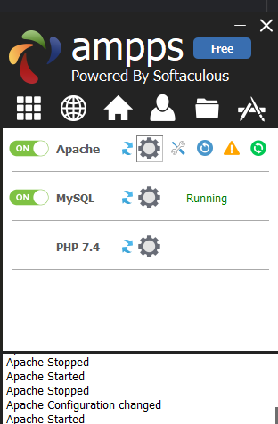
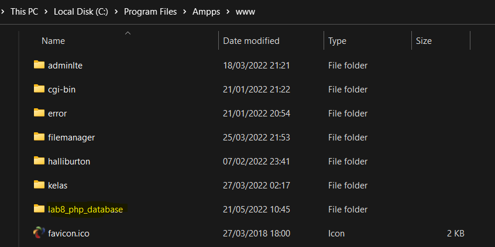

# Praktikum 8 - Pertemuan 10 - Pemrograman Web

| Nama | Febro Herdyanto |
| --- | --- |
| NIM | 312010043 |
| Kelas | TI.20.B.1 |
| Mata Kuliah | Pemrograman Web |
| Dosen | Agung Nugroho,S.Kom.,M.Kom |

Hi! Saya kali ini akan membuat folder baru dengan nama Pertemuan 10, dimana pada folder ini akan menjelaskan Pemrograman Web menggunakan PHP dan MySQL.  
Pada pertemuan 9, saya sudah menjelaskan bagaimana cara membuat file sederhana menggunakan PHP. Dan ini adalah salah satu tugas dari mata kuliah saya Pemrograman Web yang diampu oleh Bapak Agung Nugroho di Universitas Pelita Bangsa Cikarang, Bekasi.  
Langsung mulai sajaa...

## `Web Server Preparation`

Pada point *Web Server Preparation*, sebelumnya saya menggunakan XAMPP. Berhubung XAMPP saya sedang bermasalah dengan SQL, maka saya ganti menggunakan Ampps. Penggunaannya sama dengan XAMPP.  
Disini saya akan menjalankan Apache dan MySQL pada aplikasi Ampps.  
  
Selain itu saya juga membuat folder pada **root directory** Ampps tersebut. Root directory terletak pada **C:\Program Files\Ampps\www**.  
