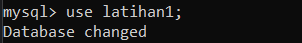
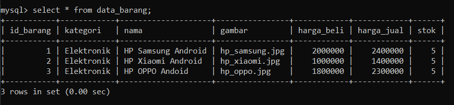

# Praktikum 8 - Pertemuan 10 - Pemrograman Web

<hr>

| Nama | Febro Herdyanto |
| --- | --- |
| NIM | 312010043 |
| Kelas | TI.20.B.1 |
| Mata Kuliah | Pemrograman Web |
| Dosen | Agung Nugroho,S.Kom.,M.Kom |

<hr>

Hi! Saya kali ini akan membuat folder baru dengan nama Pertemuan 10, dimana pada folder ini akan menjelaskan Pemrograman Web menggunakan PHP dan MySQL. <br>
Pada pertemuan 9, saya sudah menjelaskan bagaimana cara membuat file sederhana menggunakan PHP. Dan ini adalah salah satu tugas dari mata kuliah saya Pemrograman Web yang diampu oleh Bapak Agung Nugroho di Universitas Pelita Bangsa Cikarang, Bekasi. <br>
Langsung mulai sajaa...

## `Web Server Preparation`

Pada point *Web Server Preparation*, sebelumnya saya menggunakan XAMPP. Berhubung XAMPP saya sedang bermasalah dengan SQL, maka saya ganti menggunakan Ampps. Penggunaannya sama dengan XAMPP. <br>
Disini saya akan menjalankan Apache dan MySQL pada aplikasi Ampps. <br>
 <br>
Selain itu saya juga membuat folder baru dengan nama *lab8_php_database* pada **root directory** Ampps tersebut. Root directory terletak pada **C:\Program Files\Ampps\www**. <br>


## `Create Database using CLI on Command Prompt`

Disini saya akan menjelaskan membuat database MySQL dengan menggunakan CMD / Command Prompt. Selain menggunakan CMD, pembuatan database juga dapat dilakukan menggunakan browser dan menuju ke halaman PHPMyAdmin. Dengan mengetikkan url berikut [http://localhost/phpmyadmin](http://localhost/phpmyadmin) .<br>
Berikut tampilan MySQL ketika menggunakan CLI. <br>
.

Pada gambar diatas ditampilkan bagaimana cara masuk ke direktori MySQL yang ada di Web Server kita. <br>
Langkah selanjutnya, saya akan membuat database baru dengan nama **latihan1** . Dengan mengetikkan perintah berikut pada CMD. 

```
mysql> create database latihan1;
//Query OK, 1 row affected (0.01 sec)
```


## `Create Table on Latihan1`

Tabel merupakan kumpulan data (nilai) yang diorganisasikan ke dalam baris (record) dan kolom (field). Masing-masing kolom memiliki nama yang spesifik dan unik.<br>
Setelah database dibuat, saya akan membuat table pada database latihan1. Sebelum membuat tamble, pada CLI SQL kita diharuskan memilih database yang akan digunakan dengan mengetikkan perintah berikut pada CMD. 

```
mysql> use latihan1;
//Database changed
```

 

<br>

Setelah memilih database, saatnya membuat database dengan perintah berikut.

```
mysql> create table data_barang(
    -> id_barang int(10) auto_increment Primary Key,
    -> kategori varchar(30),
    -> nama varchar(30),
    -> gambar varchar(100),
    -> harga_beli decimal(10,0),
    -> harga_jual decimal(10,0),
    -> stok int(4)
    -> );
//Query OK, 0 rows affected, 2 warnings (0.04 sec)
```


## `Add Records on Table`

Setelah table dalam database sudah dibuat, saya akan mencoba untuk menambahkan data / record pada table tersebut. Dengan memasukkan perintah berikut pada CMD.

```
mysql> insert into data_barang (kategori, nama, gambar, harga_beli, harga_jual, stok)
    -> values ('Elektronik', 'HP Samsung Android', 'hp_samsung.jpg', 2000000, 2400000, 5),
    -> ('Elektronik', 'HP Xiaomi Android', 'hp_xiaomi.jpg', 1000000, 1400000, 5),
    -> ('Elektronik', 'HP OPPO Andoid', 'hp_oppo.jpg', 1800000, 2300000, 5);
// Query OK, 3 rows affected (0.02 sec)
// Records: 3  Duplicates: 0  Warnings: 0
```


## `Show Record from Table`

Data telah berhasil ditambahkan, pada poin ini saya akan menampilkan semua data yang ada di dalam table tersebut. Dengan mengetikkan perintah berikut.

```
mysql> select * from data_barang;
+-----------+------------+--------------------+----------------+------------+------------+------+
| id_barang | kategori   | nama               | gambar         | harga_beli | harga_jual | stok |
+-----------+------------+--------------------+----------------+------------+------------+------+
|         1 | Elektronik | HP Samsung Android | hp_samsung.jpg |    2000000 |    2400000 |    5 |
|         2 | Elektronik | HP Xiaomi Android  | hp_xiaomi.jpg  |    1000000 |    1400000 |    5 |
|         3 | Elektronik | HP OPPO Andoid     | hp_oppo.jpg    |    1800000 |    2300000 |    5 |
+-----------+------------+--------------------+----------------+------------+------------+------+
// 3 rows in set (0.00 sec)
```



# `CRUD PROGRAMS`

Pada point ini saya akan mencoba membuat program menggunakan PHP - MySQL.

## `Create PHP SQL Connection`

File pertama yang saya buat adalah koneksi dari PHP ke MySQL / database yang telah saya buat sebelumnya. Saya menuliskan beberapa source code pada file **koneksi.php**.

```
<?php

$host = 'localhost';
$user = 'root';
$pass = 'mysql';
$db = 'latihan1';

$conn = mysqli_connect($host, $user, $pass, $db);

if($conn == false){
    echo "Koneksi Gagal";
    die();
} #else echo "Koneksi Berhasil";

?>
```

Hasil dari file tersebut akan menampilkan file kosong, bisa juga menampilkan output *Koneksi Berhasil* pada browser.

## `Show Data from SQL on PHP`

Disini saya akan menjelaskan menampilkan data dari database menggunakan PHP dan Bootstrap. Berikut source code yang saya gunakan.

```
<?php
include 'koneksi.php';

//Query untuk menampilkan data dari database

$sql = "select * from data_barang";
$result = mysqli_query($conn, $sql);
?>

<!DOCTYPE html>
<html lang="en">
<head>
    <meta charset="UTF-8">
    <meta http-equiv="X-UA-Compatible" content="IE=edge">
    <meta name="viewport" content="width=device-width, initial-scale=1.0">
    <title>Data Barang</title>

</head>
<body>

<div class="container">
    <div class="row">
        <div class="col-sm-12">
            <div class="text-center">
                <h1>Data Barang</h1>
                <hr>
            </div>
        </div>
    </div>
    <div class="row">
        <div class="col-sm-12">
            <a href="tambah.php" style="text-decoration: none;"><button class="btn btn-primary"><i class="fa fa-plus"></i> Tambah</button></a> <br><br>
            <table class="table table-striped table-bordered">
                <thead class="text-center">
                    <th>Gambar</th>
                    <th>Nama Barang</th>
                    <th>Kategori</th>
                    <th>Harga Beli</th>
                    <th>Harga Jual</th>
                    <th>Stok</th>
                    <th>Aksi</th>
                </thead>
                <tbody>
                    <?php
                        if($result):
                            while($row = mysqli_fetch_array($result)):
                    ?>
                    <tr>
                        <td>" class="rounded mx-auto d-block"></td>
                        <td><?= $row['nama']; ?></td>
                        <td><?= $row['kategori']; ?></td>
                        <td class="text-center"><?= $row['harga_beli']; ?></td>
                        <td class="text-center"><?= $row['harga_jual']; ?></td>
                        <td class="text-center"><?= $row['stok']; ?></td>
                        <td class="text-center"><?= $row['id_barang']; ?></td>
                    </tr>
                    <?php endwhile; else: ?>
                    <tr>
                        <td colspan="7">Tidak ada data</td>
                    </tr>
                    <?php endif; ?>
                </tbody>
            </table>
        </div>
    </div>
    <hr>
    <div class="row">
        <div class="card col-sm-12 text-white bg-dark">
            <div class="card-body text-center">
                Febro Herdyanto - 312010043 - TI.20.B.1 <br>
                &copy; 2022 - Universitas Pelita Bangsa
            </div>
        </div>
    </div>
</div> <!-- end of Container -->

</body>
</html>
```

Hasil dari source code tersebut seperti berikut. <br>


## `Feature Add Data`

Setelah menampilkan data selesai, saatnya saya membuat form untuk menambahkan data baru menggunakan Web PHP. Saya membuat fitur Tambah Data dan file baru dengan nama **tambah.php** dengan isi source code seperti berikut.

```
<?php
include_once 'koneksi.php';
if(isset($_POST['submit'])){
    $nama = $_POST['nama'];
    $kategori = $_POST['kategori'];
    $harga_jual = $_POST['harga_jual'];
    $harga_beli = $_POST['harga_beli'];
    $stok = $_POST['stok'];

    $namafile = $_FILES['picture']['name'];  
    $ukuran = $_FILES['picture']['size'];  
    $error = $_FILES['picture']['error'];  
     
    // bila ukuran file lebih besar dari 0 dan tidak ada error
    if($ukuran > 0 || $error == 0){  
        // pindahkan file gambar dari temporary folder ke folder gambar	
        $move = move_uploaded_file($_FILES['picture']['tmp_name'], 'gambar/'.$namafile);  
        if($move){  

        }else{
            echo "Gambar Gagal disimpan";
        }
    }


    $sql = 'INSERT INTO data_barang (nama, kategori,harga_jual, harga_beli, stok, gambar) ';
    $sql .= "VALUE ('{$nama}', '{$kategori}','{$harga_jual}', '{$harga_beli}', '{$stok}', '{$namafile}')";
    $result = mysqli_query($conn, $sql);
    if($result == true){
        echo "DATA Berhasil disimpan";
        header('location: index.php');
    }else{
        echo "data gagal disimpan ".mysqli_error($conn).' - '.$error;
    }
}

?>

<!DOCTYPE html>
<html lang="en">
<head>
    <meta charset="UTF-8">
    <meta http-equiv="X-UA-Compatible" content="IE=edge">
    <meta name="viewport" content="width=device-width, initial-scale=1.0">
    <title>Data Barang</title>

    <link rel="stylesheet" href="https://cdn.jsdelivr.net/npm/bootstrap@4.3.1/dist/css/bootstrap.min.css" integrity="sha384-ggOyR0iXCbMQv3Xipma34MD+dH/1fQ784/j6cY/iJTQUOhcWr7x9JvoRxT2MZw1T" crossorigin="anonymous">
    <link rel="stylesheet" href="https://cdnjs.cloudflare.com/ajax/libs/font-awesome/6.1.1/css/all.min.css" integrity="sha512-KfkfwYDsLkIlwQp6LFnl8zNdLGxu9YAA1QvwINks4PhcElQSvqcyVLLD9aMhXd13uQjoXtEKNosOWaZqXgel0g==" crossorigin="anonymous" referrerpolicy="no-referrer" />

    <script src="https://code.jquery.com/jquery-3.3.1.slim.min.js" integrity="sha384-q8i/X+965DzO0rT7abK41JStQIAqVgRVzpbzo5smXKp4YfRvH+8abtTE1Pi6jizo" crossorigin="anonymous"></script>
    <script src="https://cdn.jsdelivr.net/npm/popper.js@1.14.7/dist/umd/popper.min.js" integrity="sha384-UO2eT0CpHqdSJQ6hJty5KVphtPhzWj9WO1clHTMGa3JDZwrnQq4sF86dIHNDz0W1" crossorigin="anonymous"></script>
    <script src="https://cdn.jsdelivr.net/npm/bootstrap@4.3.1/dist/js/bootstrap.min.js" integrity="sha384-JjSmVgyd0p3pXB1rRibZUAYoIIy6OrQ6VrjIEaFf/nJGzIxFDsf4x0xIM+B07jRM" crossorigin="anonymous"></script>
    <script src="https://cdnjs.cloudflare.com/ajax/libs/font-awesome/6.1.1/js/all.min.js" integrity="sha512-6PM0qYu5KExuNcKt5bURAoT6KCThUmHRewN3zUFNaoI6Di7XJPTMoT6K0nsagZKk2OB4L7E3q1uQKHNHd4stIQ==" crossorigin="anonymous" referrerpolicy="no-referrer"></script>

</head>
<body>

<div class="container">
    <div class="row">
        <div class="col-sm-12">
            <div class="text-center">
                <h1>Tambah Data Barang</h1>
                <hr>
            </div>
        </div>
    </div>
    <form method="post" action="" enctype="multipart/form-data">
    <div class="col-sm-12">
        <div class="mb-3 row">
            <label for="nama" class="col-sm-2 col-form-label">Nama Barang</label>
            <div class="col-sm-7">
                <input type="text" name="nama" class="form-control" id="nama">
            </div>
        </div>
        <div class="mb-3 row">
            <label for="kategori" class="col-sm-2 col-form-label">Kategori Barang</label>
            <div class="col-sm-7">
                <select name="kategori" class="form-control form-select">
                    <option value="Komputer">Komputer</option>
                    <option value="Elektronik">Elektronik</option>
                    <option value="Hand Phone">Hand Phone</option>
                </select>
            </div>
        </div>
        <div class="mb-3 row">
            <label for="hargabeli" class="col-sm-2 col-form-label">Harga Beli</label>
            <div class="col-sm-7">
                <input type="text" name="harga_beli" id="hargabeli" class="form-control">
            </div>
        </div>
        <div class="mb-3 row">
            <label for="hargajual" class="col-sm-2 col-form-label">Harga Jual</label>
            <div class="col-sm-7">
                <input type="text" name="harga_jual" id="hargajual" class="form-control">
            </div>
        </div>
        <div class="mb-3 row">
            <label for="stok" class="col-sm-2 col-form-label">Stok</label>
            <div class="col-sm-7">
                <input type="text" name="stok" id="stok" class="form-control">
            </div>
        </div>
        <div class="mb-3 row">
            <label for="gambar" class="col-sm-2 col-form-label">Gambar</label>
            <div class="col-sm-7">
                <input type="file" name="picture" class="form-control file-upload-info" placeholder="Upload J
            </div>
        </div>
        <div class="mb-3 row">
            <div class="col-sm-7">
                <button type="submit" name="submit" class="btn btn-primary"><i class="fa fa-save"></i> Simpan</button>
            </div>
        </div>
    </div>
    </form>
</div> <!-- end of Container -->

</body>
</html>
```

Hasil tampilan awal ketika form tambah data seperti berikut. <br>
 <br>

Kemudian data tersebut akan tampil pada halaman Utama. Seperti berikut sudah saya modifikasi. <br>


## `Feature Edit Data`

Pada poin ini saya akan membuat menu Ubah Data, dengan itu saya membuat file baru dengan nama **ubah.php**. Dengan source code berikut.

```
<?php

include_once 'koneksi.php';
if(isset($_POST['submit'])){
    $id = $_POST['id'];
    $nama = $_POST['nama'];
    $kategori = $_POST['kategori'];
    $harga_jual = $_POST['harga_jual'];
    $harga_beli = $_POST['harga_beli'];
    $stok = $_POST['stok'];
    
    $namafile = $_FILES['picture']['name'];  
    $ukuran = $_FILES['picture']['size'];  
    $error = $_FILES['picture']['error'];  
     
    // bila ukuran file lebih besar dari 0 dan tidak ada error
    if($ukuran > 0 || $error == 0){  
        // pindahkan file gambar dari temporary folder ke folder gambar	
        $move = move_uploaded_file($_FILES['picture']['tmp_name'], 'gambar/'.$namafile);  
        if($move){  

        }else{
            echo "Gambar Gagal disimpan";
        }
    }

    $sql = 'UPDATE data_barang SET ';
    $sql .= "nama = '{$nama}', kategori = '{$kategori}', ";
    $sql .= "harga_jual = '{$harga_jual}', harga_beli = '{$harga_beli}', stok= '{$stok}' ";
    
    if (!empty($namafile))
        $sql .= ", gambar = '{$namafile}' ";
        $sql .= "WHERE id_barang = '{$id}'";
        $result = mysqli_query($conn, $sql);
        
        if($result == true){
            echo "DATA Berhasil disimpan";
            header('location: index.php');
        }else{
            echo "data gagal disimpan ".mysqli_error($conn).' - '.$error;
        }
    }


// ============== GET DATA FROM URL

$id = $_GET['id'];
$sql = "SELECT * FROM data_barang WHERE id_barang = '{$id}'";
$result = mysqli_query($conn, $sql);

if (!$result) die('Error: Data tidak tersedia');
    $data = mysqli_fetch_array($result);
    
    function is_select($var, $val) {
        if ($var == $val) return 'selected="selected"';
        return false;
    }
?>

<!DOCTYPE html>
<html lang="en">
<head>
    <meta charset="UTF-8">
    <meta http-equiv="X-UA-Compatible" content="IE=edge">
    <meta name="viewport" content="width=device-width, initial-scale=1.0">
    <title>Data Barang</title>

    <link rel="stylesheet" href="https://cdn.jsdelivr.net/npm/bootstrap@4.3.1/dist/css/bootstrap.min.css" integrity="sha384-ggOyR0iXCbMQv3Xipma34MD+dH/1fQ784/j6cY/iJTQUOhcWr7x9JvoRxT2MZw1T" crossorigin="anonymous">
    <link rel="stylesheet" href="https://cdnjs.cloudflare.com/ajax/libs/font-awesome/6.1.1/css/all.min.css" integrity="sha512-KfkfwYDsLkIlwQp6LFnl8zNdLGxu9YAA1QvwINks4PhcElQSvqcyVLLD9aMhXd13uQjoXtEKNosOWaZqXgel0g==" crossorigin="anonymous" referrerpolicy="no-referrer" />

    <script src="https://code.jquery.com/jquery-3.3.1.slim.min.js" integrity="sha384-q8i/X+965DzO0rT7abK41JStQIAqVgRVzpbzo5smXKp4YfRvH+8abtTE1Pi6jizo" crossorigin="anonymous"></script>
    <script src="https://cdn.jsdelivr.net/npm/popper.js@1.14.7/dist/umd/popper.min.js" integrity="sha384-UO2eT0CpHqdSJQ6hJty5KVphtPhzWj9WO1clHTMGa3JDZwrnQq4sF86dIHNDz0W1" crossorigin="anonymous"></script>
    <script src="https://cdn.jsdelivr.net/npm/bootstrap@4.3.1/dist/js/bootstrap.min.js" integrity="sha384-JjSmVgyd0p3pXB1rRibZUAYoIIy6OrQ6VrjIEaFf/nJGzIxFDsf4x0xIM+B07jRM" crossorigin="anonymous"></script>
    <script src="https://cdnjs.cloudflare.com/ajax/libs/font-awesome/6.1.1/js/all.min.js" integrity="sha512-6PM0qYu5KExuNcKt5bURAoT6KCThUmHRewN3zUFNaoI6Di7XJPTMoT6K0nsagZKk2OB4L7E3q1uQKHNHd4stIQ==" crossorigin="anonymous" referrerpolicy="no-referrer"></script>

</head>
<body>

<div class="container">
    <div class="row">
        <div class="col-sm-12">
            <div class="text-center">
                <h1><i class="fa fa-edit"></i> Ubah Data Barang</h1>
                <hr>
            </div>
        </div>
    </div>
    <form method="post" action="" enctype="multipart/form-data">
    <div class="col-sm-12">
        <div class="mb-3 row">
            <label for="nama" class="col-sm-2 col-form-label">Nama Barang</label>
            <div class="col-sm-7">
                <input type="text" name="nama" class="form-control" value="<?php echo $data['nama'] ?>" id="nama">
            </div>
        </div>
        <div class="mb-3 row">
            <label for="kategori" class="col-sm-2 col-form-label">Kategori Barang</label>
            <div class="col-sm-7">
                <select name="kategori" class="form-control form-select">
                    <option <?php echo is_select('Komputer', $data['kategori']); ?> value="Komputer">Komputer</option>
                    <option <?php echo is_select('Elektronik', $data['kategori']); ?> value="Elektronik">Elektronik</option>
                    <option <?php echo is_select('Hand Phone', $data['kategori']); ?> value="Hand Phone">Hand Phone</option>
                </select>
            </div>
        </div>
        <div class="mb-3 row">
            <label for="hargabeli" class="col-sm-2 col-form-label">Harga Beli</label>
            <div class="col-sm-7">
                <input type="text" name="harga_beli" value="<?php echo $data['harga_beli']; ?>" id="hargabeli" class="form-control">
            </div>
        </div>
        <div class="mb-3 row">
            <label for="hargajual" class="col-sm-2 col-form-label">Harga Jual</label>
            <div class="col-sm-7">
                <input type="text" name="harga_jual" value="<?php echo $data['harga_jual']; ?>" id="hargajual" class="form-control">
            </div>
        </div>
        <div class="mb-3 row">
            <label for="stok" class="col-sm-2 col-form-label">Stok</label>
            <div class="col-sm-7">
                <input type="text" name="stok" value="<?php echo $data['stok']; ?>" id="stok" class="form-control">
            </div>
        </div>
        <div class="mb-3 row">
            <label for="gambar" class="col-sm-2 col-form-label">Preview Gambar</label>
            <div class="col-sm-7">
                " class="rounded float-start" alt="<?php echo "Gambar ".$data['nama']; ?>" width="150px" height="150px">
            </div>
        </div>
        <div class="mb-3 row">
            <label for="gambar" class="col-sm-2 col-form-label">Ubah Gambar</label>
            <div class="col-sm-7">
                <input type="file" name="picture" class="form-control file-upload-info"> <i style="color: grey;">* Kosongkan Apabila tidak dirubah</i>
            </div>
        </div>
        <div class="mb-3 row">
            <div class="col-sm-7">
                <button type="submit" name="submit" class="btn btn-primary"><i class="fa fa-save"></i> Simpan</button>
            </div>
        </div>
    </div>
    </form>
</div> <!-- end of Container -->

</body>
</html>
```

Berikut hasil yang saya dapatkan dari browser. <br>


<br>


## `Feature Delete Data`

Pada poin ini saya membuat fitur hapus data dengan membuat file baru dengan nama **hapus.php**.

```
<?php
include_once 'koneksi.php';
$id = $_GET['id'];
$sql = "DELETE FROM data_barang WHERE id_barang = '{$id}'";
$result = mysqli_query($conn, $sql);

echo "<script>alert('Data Berhasil Dihapus'); window.location.href = 'index.php'</script>";
?>
```

Hasil pada output tersebut akan menampilkan alert javascript. <br>


<br>

