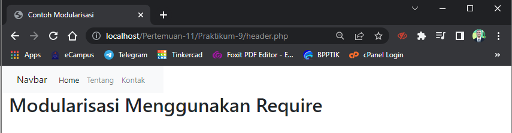
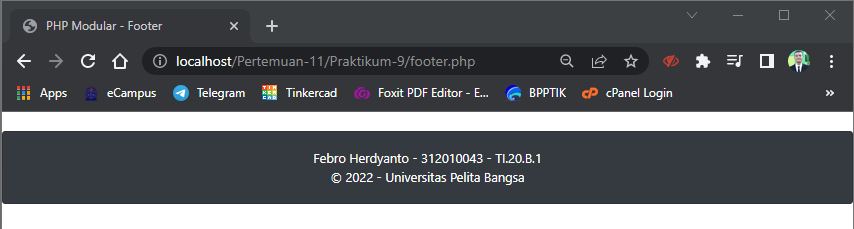
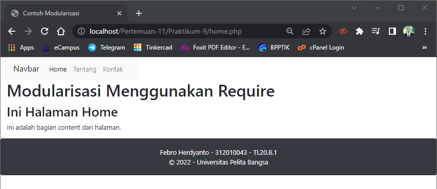
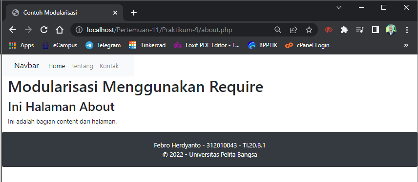
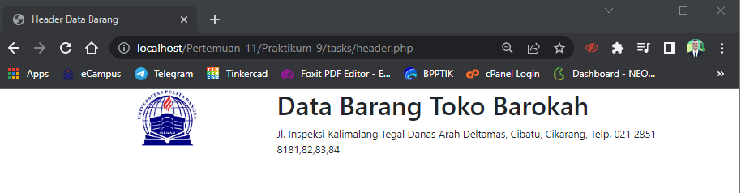
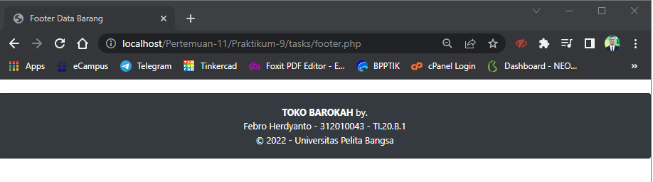

# Praktikum 9 (PHP Modular) - Pertemuan 11 - Pemrograman Web

<hr>

| Nama | Febro Herdyanto |
| --- | --- |
| NIM | 312010043 |
| Kelas | TI.20.B.1 |
| Mata Kuliah | Pemrograman Web |
| Dosen | Agung Nugroho,S.Kom.,M.Kom |

<hr>

Hi! Pada Folder ini saya akan membahas mengenai PHP Modular. Ada beberapa hal yang saya lakukan pada materi ini.

## `Create Header`

Kali ini saya akan membuat header pada file yang diberikan oleh dosen, saya membuat file baru dengan nama **header.php** dengan mengisikan source code sebagai berikut.

```
<!DOCTYPE html>
<html lang="en">
<head>
    <meta charset="UTF-8">
    <meta http-equiv="X-UA-Compatible" content="IE=edge">
    <meta name="viewport" content="width=device-width, initial-scale=1.0">
    <title>Contoh Modularisasi</title>
</head>
<body>
    <div class="container-fluid">
        <div class="row">
            <nav class="navbar navbar-expand-lg navbar-light bg-light">
                <div class="container-fluid">
                    <a class="navbar-brand" href="#">Navbar</a>
                    <button class="navbar-toggler" type="button" data-bs-toggle="collapse" data-bs-target="#navbarNav" aria-controls="navbarNav" aria-expanded="false" aria-label="Toggle navigation">
                        <span class="navbar-toggler-icon"></span>
                    </button>
                    <div class="collapse navbar-collapse" id="navbarNav">
                        <ul class="navbar-nav">
                            <li class="nav-item">
                                <a class="nav-link active" aria-current="page" href="#">Home</a>
                            </li>
                            <li class="nav-item">
                                <a class="nav-link" href="#">Tentang</a>
                            </li>
                            <li class="nav-item">
                                <a class="nav-link" href="#">Kontak</a>
                            </li>
                        </ul>
                    </div>
                </div>
            </nav>
        </div>
        <div class="row">

        </div>
        <header>
            <h1>Modularisasi Menggunakan Require</h1>
        </header>
    </div>
</body>
</html>
```

Hasil pada Header tersebut akan seperti ini.


## `Create Footer`

Setelah membuat header, saya akan membuat footer. Dengan membuat file baru dengan nama **footer.php**.

```
    <div class="row">
        <div class="col col-sm-12">
            <div class="card text-white bg-dark mb-1">
                <div class="card-body text-center">
                    Febro Herdyanto - 312010043 - TI.20.B.1 <br>
                    &copy; 2022 - Universitas Pelita Bangsa
                </div>
            </div>
        </div>
    </div>
```

Hasil dari footer tersebut, akan menampilkan seperti berikut. <br>


## `Create Home Page`

Setelah header dan footer terbuat, saya akan membuat konten pada halaman home. Dengan membuat file baru dengan nama **home.php** dan mengisikan source code berikut.

```
<?php
require('header.php');
?>

<div class="container-fluid">
    <h2>Ini Halaman Home</h2>
    <p>Ini adalah bagian content dari halaman.</p>
</div>

<?php require('footer.php'); ?>
```

Hasil dari Home Page akan seperti berikut. <br>


## `Create About Page`

Saya akan membuat konten pada Halaman About. dengan membuat file baru **about.php** dan mengisikan source code dibawah ini.

```
<?php
require('header.php');
?>

<div class="container-fluid">
    <h2>Ini Halaman About</h2>
    <p>Ini adalah bagian content dari halaman.</p>
</div>

<?php require('footer.php'); ?>
```

Hasil dari Halaman About akan muncul seperti berikut. <br>


## `Question and Task`

> Implementasikan konsep modularisasi pada kode program praktikum 8 tentang database, sehingga setiap halamannya memiliki template tampilan yang sama.

## `Answer`

> Saya akan membuat folder baru dengan nama **tasks* dan akan dijelaskan didalamnya

<hr>

### `Heaer View`



### `Footer View`

