# Praktikum 11 - Pertemuan 12 - Pemrograman Web

<hr>

| Nama | Febro Herdyanto |
| --- | --- |
| NIM | 312010043 |
| Kelas | TI.20.B.1 |
| Mata Kuliah | Pemrograman Web |
| Dosen | Agung Nugroho,S.Kom.,M.Kom |

<hr>

Hi! Pada pertemuan sebelumnya saya sudah membuat beberapa materi mengenai PHP, mulai CRUD menggunakan MySQL, PHP Modular, PHP OOP. Kali ini saya akan membuat materi/tugas mengenai Framework Code Igniter 4.

### `Preparation`

Pada point *preparation* saya melakukan konfigurasi pada Web Server (Ampps). Beberapa ekstensi PHP yang saya aktifkan sesuai dengan perintah dari Dosen. 

* **php-json** ekstension untuk bekerja dengan JSON;
* **php-mysqlnd** native driver untuk MySQL;
* **php-xml** ekstension untuk bekerja dengan XML;
* **php-intl** ekstensi untuk membuat aplikasi multibahasa;
* **libcurl** (opsional), jika ingin pakai Curl

### `Code Igniter 4 Installation`

Disini saya akan mengunduh file dari Code Igniter yang akan digunakan pada web [https://codeigniter.com/download](https://codeigniter.com/download) . Kemudian akan saya simpan pada docroot Web Server (Ampps) saya. Saya ekstrak dan ubah nama folder menjadi **ci4**. <br>


Kemudian saya buka di Browser, akan muncul tampilan seperti berikut. <br>
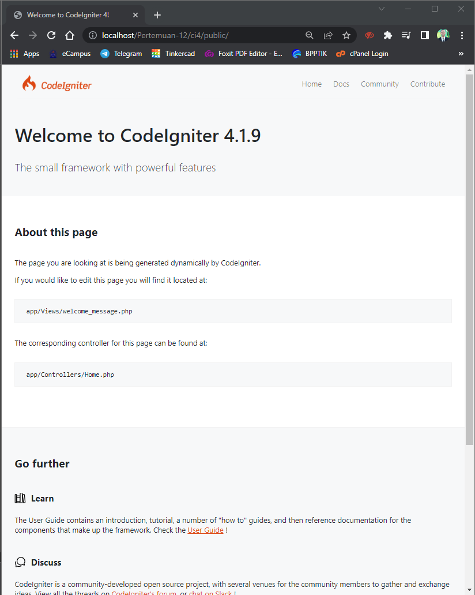

### `PHP Spark on CLI (Command Line Interface)`

Codeigniter 4 menyediakan CLI untuk mempermudah proses development. Untuk mengakses CLI buka terminal/command prompt. Arahkan pada direktori folder yang telah kita buat, yaitu **ci4**. 

```
febro@febroherdyanto MINGW64 ~/OneDrive/IT/backup-github/UPB-TI/SMT 4 - Pemrograman Web/Pertemuan-12/ci4 $ php spark
```

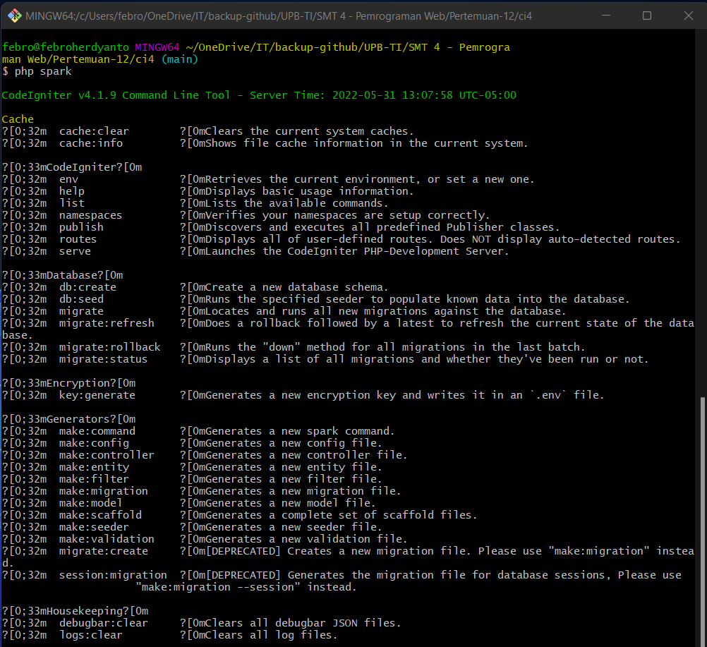

### `Turn On Debugging Mode`

Untuk mengubah ke mode debugging, kita harus mengubah **environment** menjadi *development* pada file **.env**. <br>
Sebelumnya, silahkan rename file **env** menjadi **.env** terlebih dahulu. <br>
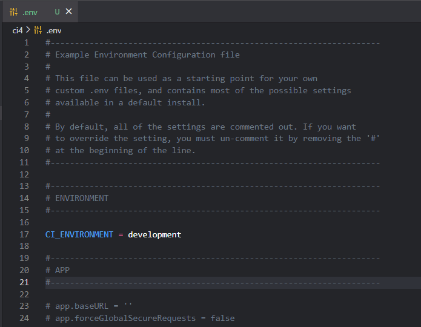

<br>

Sebagai contoh, saya akan mengubah salah satu file dan akan menampilkan pesan error pada browser. <br>
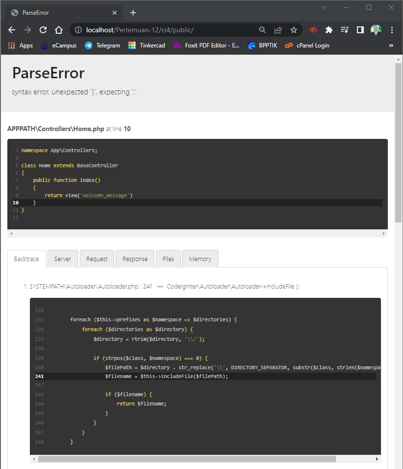

### `Create New Routes`

Setelah semua installasi selesai, saat ini saya akan mencoba untuk menambahkan Routes baru dalam file **app/Config/Routes.php**.

```
$routes->get('/about', 'Page::about');
$routes->get('/contact', 'Page::contact');
$routes->get('/faqs', 'Page::faqs');
```

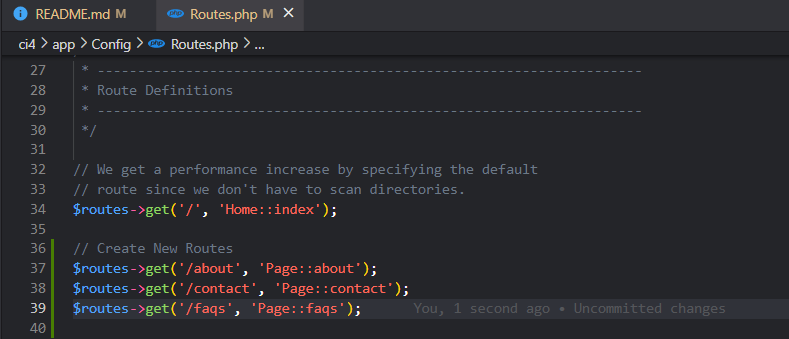

<br>

Untuk mengetahui route yang ditambahkan sudah benar, buka CLI dan jalankan perintah berikut.

```
febro@febroherdyanto MINGW64 ~/OneDrive/IT/backup-github/UPB-TI/SMT 4 - Pemrograman Web/Pertemuan-12/ci4
$ php spark routes
```

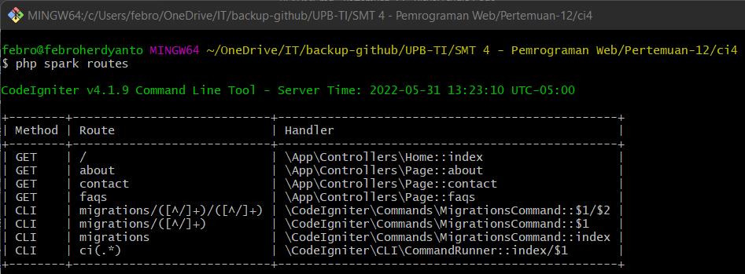 <br>

Setelah itu kita cek di web Browser dengan mengetikan docroot kita ditambah **/about**. Akan menampilkan hasil seperti dibawah ini. <br>
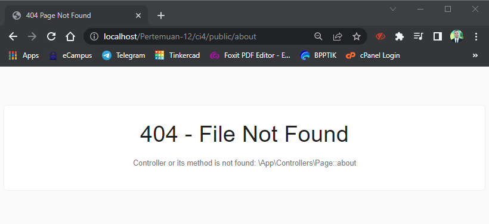

### `Create Controller`

Setelah Routes berhasil saya buat, saya akan membuat Controller untuk menampilkan isi dalam browser yang terjadi Not Found sebelumnya. Saya membuat file baru dengan nama **Page.php** pada direktori **app/Controller**. Kemudian mengisikan source code dibawah ini.

```
<?php

namespace App\Controllers;

class Page extends BaseController{

    public function about(){
        echo "<h1>Ini Halaman About</h1>";
    }

    public function contact(){
        echo "<h1>Ini Halaman Contact</h1>";
    }

    public function faqs(){
        echo "<h1>Ini Halaman FAQ</h1>";
    }

}

?>
```

Hasil setelah file tersebut disimpan dan merefresh kembali browser, akan menampilkan hasil. <br>
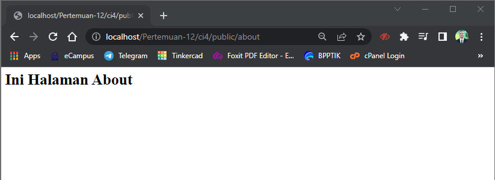

#### `Add New Controller TOS`

Disini saya akan membuat Controller Page baru dengan nama tos. Method ini belum ada pada Routing yang seharusnya dibuat sebelumnya. 

```
...
    public function tow(){
        echo "<h1>Ini Halaman Term of Services</h1>";
    }
...
```

Sehingga halaman tos hanya bisa diakses melalui **.../page/tos**. Berikut tampilannya. <br>


### `Create View`

Pada point ini saya akan membuat tampilan web agar lebih menarik. Saya membuat file baru dengan nama **about.php** pada directory **app/Views/about.php** dengan source code dibawah ini.

```
<!DOCTYPE html>
<html lang="en">
<head>
    <meta charset="UTF-8">
    <meta http-equiv="X-UA-Compatible" content="IE=edge">
    <meta name="viewport" content="width=device-width, initial-scale=1.0">
    <title><?= $title; ?></title>
</head>
<body>
    
    <h1><?= $title; ?></h1>
        <hr>
    <p><?= $content; ?></p>

</body>
</html>
```

Setelah View About dibuat, saya akan mengubah method Class About pada Controller Page menjadi :.

```
...
    public function about(){
        return view('about', [
            'title' => 'Halaman About',
            'content' => 'Ini adalah Halaman About yang menjelaskan tentang isi halaman, dibuat melalui Views'
        ]);
    }
...
```

Hasil dari View dan Controller Page yang telah diubah akan menjadi seperti dibawah ini. <br>
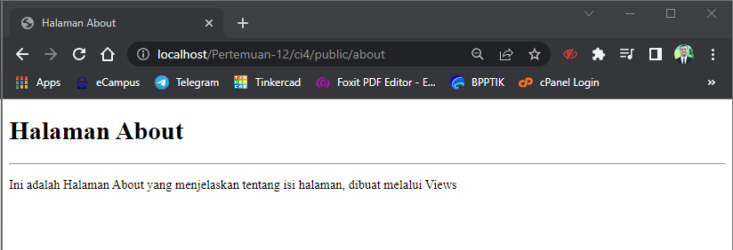

### `Create Layout Website using CSS`

Disini saya akan lebih mempercantik tampilan Website menggunakan CSS. Untuk menambahkan CSS bisa diletakkan pada folder **public**. Saya akan membuat folder baru dengan nama **template** dan membuat beberapa bagian template dibagi menjadi dua, yaitu Header dan Footer.

Pertama, saya akan memodifikasi tampilan About.

Header yang saya buat.

```
<!DOCTYPE html>
<html lang="en">
<head>
    <meta charset="UTF-8">
    <meta http-equiv="X-UA-Compatible" content="IE=edge">
    <meta name="viewport" content="width=device-width, initial-scale=1.0">
    <title><?= $title; ?></title>    
</head>
<body>

<div class="container" style="box-shadow: 0 0 1em #cccccc">
    <div class="row">
        <header>
            <h1>Layout Sederhana</h1>
        </header>
    </div>
    <div class="row">
        <nav class="navbar navbar-collapse navbar-expand navbar-dark bg-primary">
            <div class="container-fluid">
                <div class="collapse navbar-collapse">
                    <ul class="navbar-nav" style="font-size: 14px; font-weight: bold;">
                        <li class="nav-item" style="padding-right: 15px;">
                            <a class="nav-link active" href="<?= base_url('/'); ?>">Home</a>
                        </li>
                        <li class="nav-item" style="padding-right: 15px;">
                            <a class="nav-item">
                                <a href="<?= base_url('/artikel'); ?>" class="nav-link">Artikel</a>
                            </a>
                        </li>
                        <li class="nav-item" style="padding-right: 15px;">
                            <a class="nav-item">
                                <a href="<?= base_url('/about'); ?>" class="nav-link">About</a>
                            </a>
                        </li>
                        <li class="nav-item" style="padding-right: 15px;">
                            <a class="nav-item">
                                <a href="<?= base_url('/contact'); ?>" class="nav-link">Contact</a>
                            </a>
                        </li>
                    </ul>
                </div>
            </div>
        </nav>
    </div> <br>
    <div class="row">
```

<br>

Sedangkan itu, halaman footer yang saya buat. 

```

        <div class="col col-4">
            <ul class="list-group">
                <li class="list-group-item active fw-bolder" aria-current="true">Widget Header</li>
                <li class="list-group-item">E-Campus PB</li>
                <li class="list-group-item">Portfolio</li>
                <li class="list-group-item">Widget Link</li>
                <li class="list-group-item">Widget Link</li>
                <li class="list-group-item">Widget Link</li>
            </ul>

            <br><br>

            <div class="card mb-3" style="max-width: 18rem;">
                <div class="card-header text-white bg-primary fw-bolder">Widget Text</div>
                <div class="card-body">
                  Lorem ipsum dolor sit amet consectetur adipisicing elit. Ipsum quidem vitae mollitia suscipit dolores non deleniti, quis autem reiciendis eos, labore iure nam facilis minus id laborum maiores laboriosam ipsam?
                </div>
            </div>
        </div>
    </div>
    <div class="row">
        <div class="col-sm-12">
            <div class="card text-white bg-dark mb-1">
                <div class="card-body text-center">
                    Febro Herdyanto - 312010043 - TI.20.B.1 <br>
                    &copy; 2022 - Universitas Pelita Bangsa
                </div>
            </div>
        </div>
    </div>
</div>

</body>
</html>
```

Setelah Header dan Footer selesai dibuat, saya akan memodifikasi halaman inti pada About.

```
<?= $this->include('template/header'); ?>

<div class="col-sm-8">
    <h1><?= $title; ?></h1>
        <hr>
    <p><?= $content; ?></p>
</div>
<?= $this->include('template/footer'); ?>
```

Semua telah selesai dibuat, saya akan melakukan refresh pada halaman About di Browser. <br>
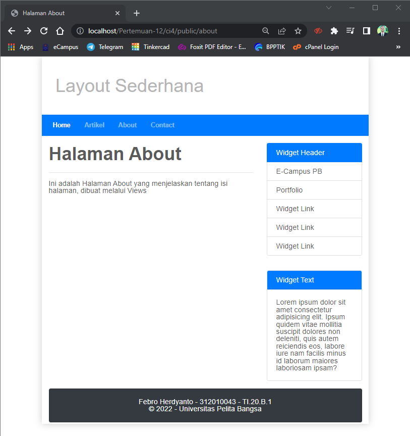

## `Question and Task`

> Lengkapi kode program untuk menu lainnya yang ada pada Controller Page, sehingga semua link pada navigasi header dapat menampilkan tampilan dengan layout yang sama.

<hr>

## `Answers`

Saya telah membuat Routes, Controller Page, dan View untuk menu Artikel, dan Cntact. Dimana semua isi berada pada template yang telah disediakan.<br>

* **Article Page** <br>
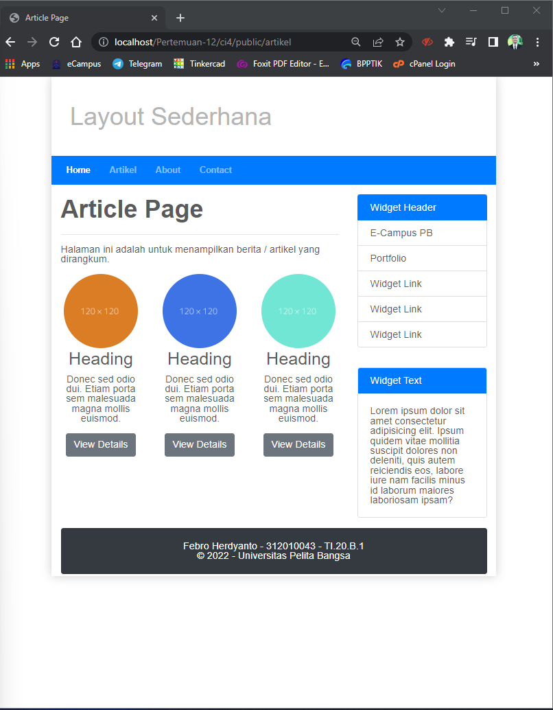

<br>

* **Contact Page** <br>
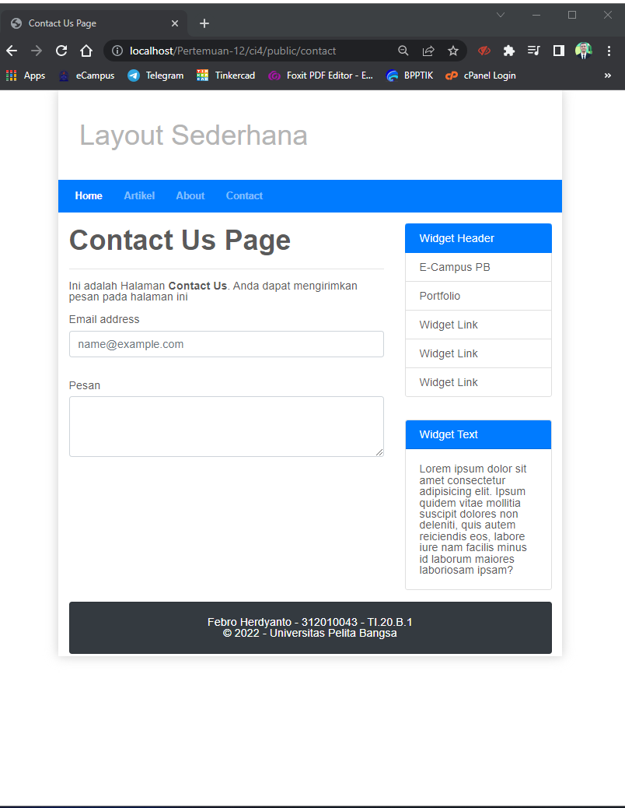