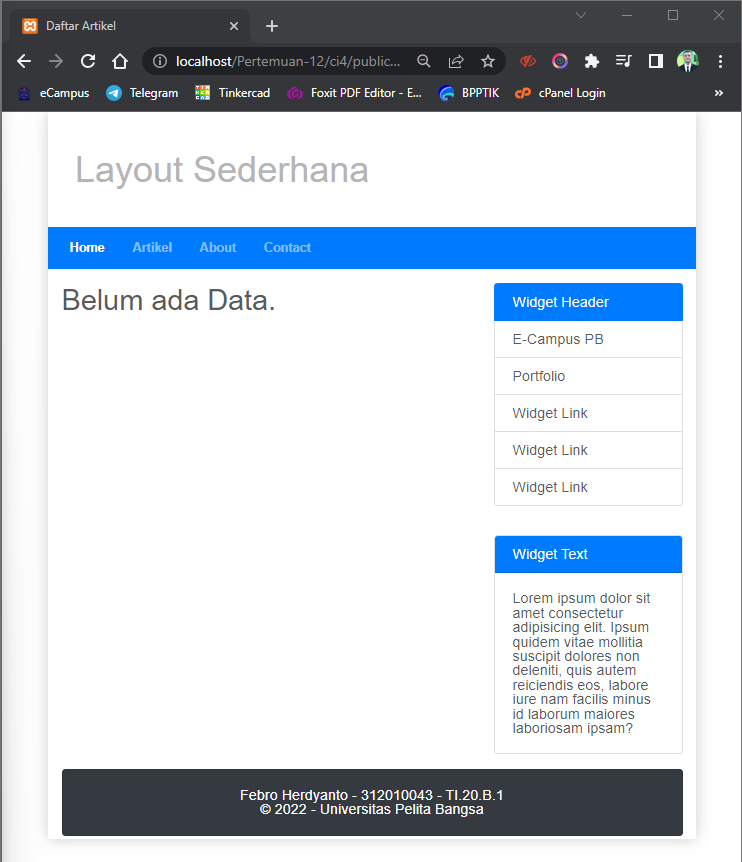

# Praktikum 12 - Pertemuan 13 - Pemrograman Web

<hr>

| Nama | Febro Herdyanto |
| --- | --- |
| NIM | 312010043 |
| Kelas | TI.20.B.1 |
| Mata Kuliah | Pemrograman Web |
| Dosen | Agung Nugroho,S.Kom.,M.Kom |

<hr>

Hi. Setelah saya membuat aplikasi CI-4 pada praktikum-11 (Pertemuan 12) sebelumnya, kali ini saya akan membuat aplikasi CRUD menggunakan CI-4.

<br>

### `Manage Database Artikel`

Hal yang pertama saya lakukan adalah membuat database pada MySQL.

```
mysql> create database lab_ci4;
Query OK, 1 row affected (0.01 sec)

mysql> use lab_ci4;
Database changed
mysql> create table artikel(
    -> id int(11) auto_increment,
    -> judul varchar(200) not null,
    -> isi text,
    -> gambar varchar(200),
    -> status tinyint(1) default 0,
    -> slug varchar(200),
    -> primary key(id)
    -> );
Query OK, 0 rows affected, 2 warnings (0.04 sec)
```


### `Configure Database Connection`

Selanjutnya saya akan melakukan konfigurasi pada database **lab_ci4**. Dengan melakukan konfigurasi file databases.php pada **App/Config/Database.php**.

```
public $default = [
        'DSN'      => '',
        'hostname' => 'localhost',
        'username' => 'root',
        'password' => 'mysql',
        'database' => 'lab_ci4',
        'DBDriver' => 'MySQLi',
        'DBPrefix' => '',
        'pConnect' => false,
        'DBDebug'  => (ENVIRONMENT !== 'production'),
        'charset'  => 'utf8',
        'DBCollat' => 'utf8_general_ci',
        'swapPre'  => '',
        'encrypt'  => false,
        'compress' => false,
        'strictOn' => false,
        'failover' => [],
        'port'     => 3306,
    ];
```

### `Create a Model`

Saya akan membuat Model baru dengan nama **ArtikelModel.php**.

```
<?php

namespace App\Models;

use CodeIgniter\Model;

class ArtikelModel extends Model{
    protected $table = 'artikel';
    protected $primaryKey = 'id';
    protected $useAutoIncrement = true;
    protected $allowedFields = ['judul','isi','status','slug','gambar'];
}

?>
```

### 'Create a Controller`

Sebelumnya saya telah membuat controller artikel, saya akan mengubahnya

```
...
use App\Models\ArtikelModel;
...


...
    public function artikel()
    {
        $title = 'Daftar Artikel';
        $model = new ArtikelModel();
        $artikel = $model->findAll();
        return view('artikel/index', compact('artikel','title'));
    }
...
```

### `Create View`

Saya akan membuat View untuk memasukkan tampilan Artikel pada tamplate yang telah saya buat sebelumnya. Dengan membuat folder **artikel** baru pada View dan mengisi **index.php**.

```
<?= $this->include('template/header'); ?>

<div class="col-sm-8">
<?php 
if($artikel): foreach($artikel as $row): ?>

    <article class="entry">
        <h2><a href="<?= base_url('/artikel/' . $row['slug']);?>"><?= $row['judul']; ?></a></h2>
        " alt="<?= $row['judul']; ?>">
        <p><?= substr($row['isi'], 0, 200); ?></p>
    </article>

    <hr class="divider">

    <?php endforeach; else: ?>
    
        <article class="entry">
            <h2>Belum ada Data.</h2>
        </article>
    <?php endif; ?>

</div>
<?= $this->include('template/footer'); ?>
```



### `Insert Data to Database`

Saya akan memasukkan data pada database.

```
mysql> INSERT INTO artikel (judul, isi, slug) VALUE
    -> ('Artikel pertama', 'Lorem Ipsum adalah contoh teks atau dummy dalam industri
    '> percetakan dan penataan huruf atau typesetting. Lorem Ipsum telah menjadi
    '> standar contoh teks sejak tahun 1500an, saat seorang tukang cetak yang tidak
    '> dikenal mengambil sebuah kumpulan teks dan mengacaknya untuk menjadi sebuah
    '> buku contoh huruf.', 'artikel-pertama'),
    -> ('Artikel kedua', 'Tidak seperti anggapan banyak orang, Lorem Ipsum bukanlah
    '> teks-teks yang diacak. Ia berakar dari sebuah naskah sastra latin klasik dari
    '> era 45 sebelum masehi, hingga bisa dipastikan usianya telah mencapai lebih
    '> dari 2000 tahun.', 'artikel-kedua');
Query OK, 2 rows affected (0.01 sec)
Records: 2  Duplicates: 0  Warnings: 0
```


### `Detail Full Article`

`Membuat Controller`

Saya akan membuat controller **view**.

```
...
    public function view($slug){
        $model = new ArtikelModel();
        $artikel = $model->where([
            'slug' => $slug
        ])->first();

        //Menampilkan error apabila tidak ada data
        if(!$artikel){
            throw PageNotFoundException::forPageNotFound()
        }
        $title = $artikel['judul'];
        return view('artikel/detail', compact('artikel','title'));
    }
...
```

`Membuat View Detail`

Saya akan membuat view detail.

```
<?= $this->include('template/header'); ?>

<div class="col-sm-8">
    <article class="entry">
        <h2><?= $artikel['judul']; ?></h2>
        " alt="<?= $artikel['judul']; ?>">
        <p><?= $row['isi']; ?></p>
    </article>
</div>
<?= $this->include('template/footer'); ?>
```

`Membuat Routing untuk Detail Artikel`

Saya akan menambahkan routing baru.

```
...
$routes->get('/artikel/(:any)', 'Artikel::view/$1');
...
```

Berikut adalah tampilan ketika detail artikel ditampilkan

