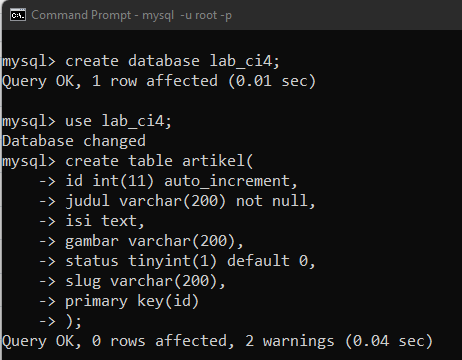

# Praktikum 12 - Pertemuan 13 - Pemrograman Web

<hr>

| Nama | Febro Herdyanto |
| --- | --- |
| NIM | 312010043 |
| Kelas | TI.20.B.1 |
| Mata Kuliah | Pemrograman Web |
| Dosen | Agung Nugroho,S.Kom.,M.Kom |

<hr>

Hi. Setelah saya membuat aplikasi CI-4 pada praktikum-11 (Pertemuan 12) sebelumnya, kali ini saya akan membuat aplikasi CRUD menggunakan CI-4.

<br>

### `Manage Database Artikel`

Hal yang pertama saya lakukan adalah membuat database pada MySQL.

```
mysql> create database lab_ci4;
Query OK, 1 row affected (0.01 sec)

mysql> use lab_ci4;
Database changed
mysql> create table artikel(
    -> id int(11) auto_increment,
    -> judul varchar(200) not null,
    -> isi text,
    -> gambar varchar(200),
    -> status tinyint(1) default 0,
    -> slug varchar(200),
    -> primary key(id)
    -> );
Query OK, 0 rows affected, 2 warnings (0.04 sec)
```



### `Configure Database Connection`

Selanjutnya saya akan melakukan konfigurasi pada database **lab_ci4**. 