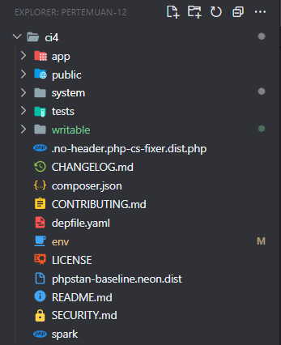
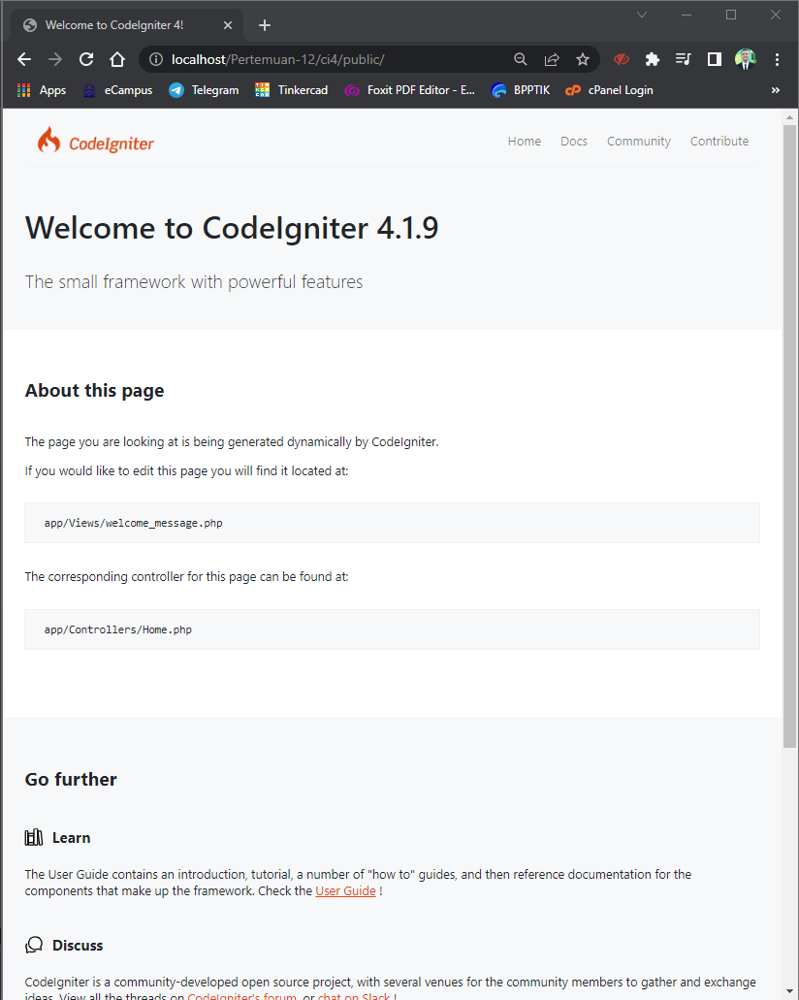

# Praktikum 11 - Pertemuan 12 - Pemrograman Web

| Nama | Febro Herdyanto |
| --- | --- |
| NIM | 312010043 |
| Kelas | TI.20.B.1 |
| Mata Kuliah | Pemrograman Web |
| Dosen | Agung Nugroho,S.Kom.,M.Kom |

Hi! Pada pertemuan sebelumnya saya sudah membuat beberapa materi mengenai PHP, mulai CRUD menggunakan MySQL, PHP Modular, PHP OOP. Kali ini saya akan membuat materi/tugas mengenai Framework Code Igniter 4.

### `Preparation`

Pada point *preparation* saya melakukan konfigurasi pada Web Server (Ampps). Beberapa ekstensi PHP yang saya aktifkan sesuai dengan perintah dari Dosen. 

* **php-json** ekstension untuk bekerja dengan JSON;
* **php-mysqlnd** native driver untuk MySQL;
* **php-xml** ekstension untuk bekerja dengan XML;
* **php-intl** ekstensi untuk membuat aplikasi multibahasa;
* **libcurl** (opsional), jika ingin pakai Curl

### `Code Igniter 4 Installation`

Disini saya akan mengunduh file dari Code Igniter yang akan digunakan pada web [https://codeigniter.com/download](https://codeigniter.com/download) . Kemudian akan saya simpan pada docroot Web Server (Ampps) saya. Saya ekstrak dan ubah nama folder menjadi **ci4**.  

Kemudian saya buka di Browser, akan muncul tampilan seperti berikut.  

### `PHP Spark on CLI (Command Line Interface)`