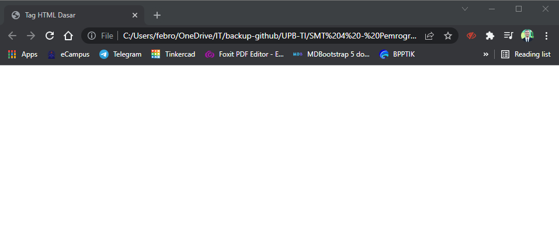
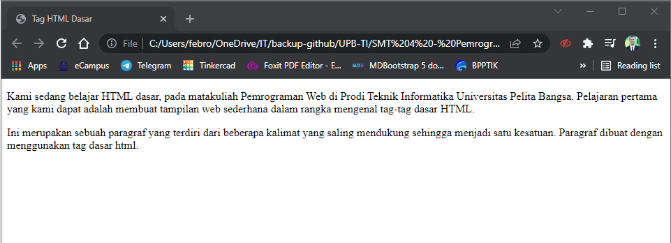
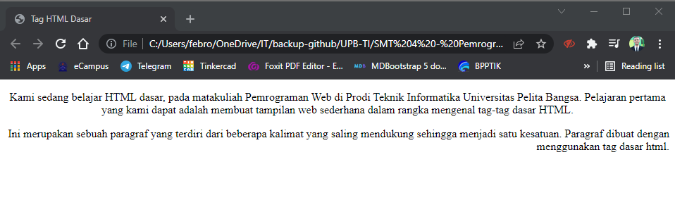
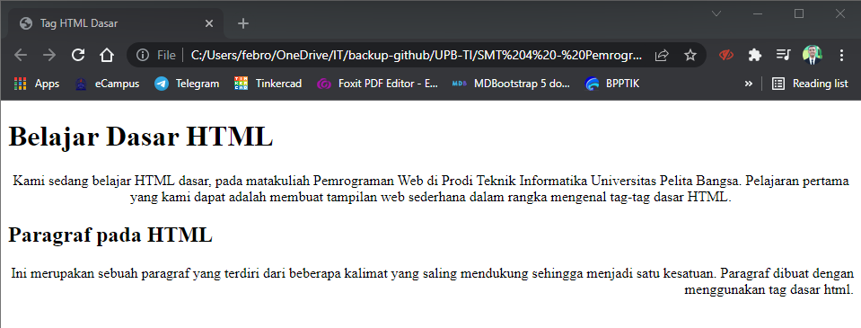
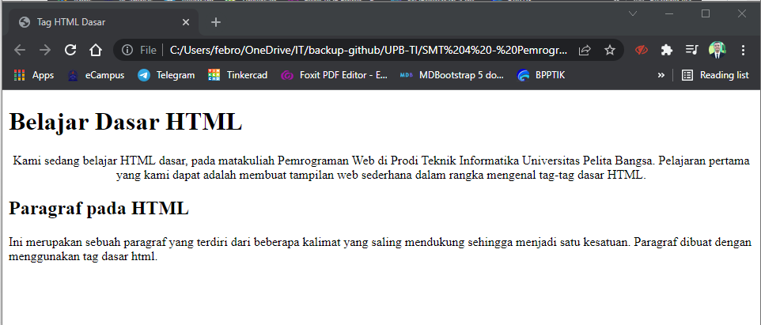
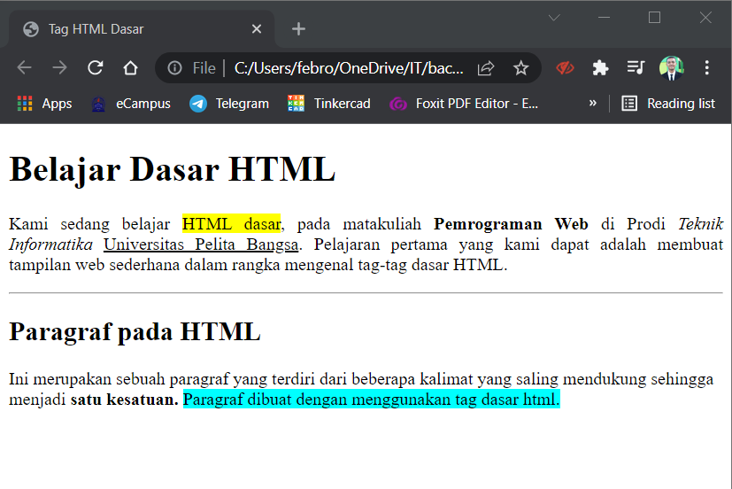
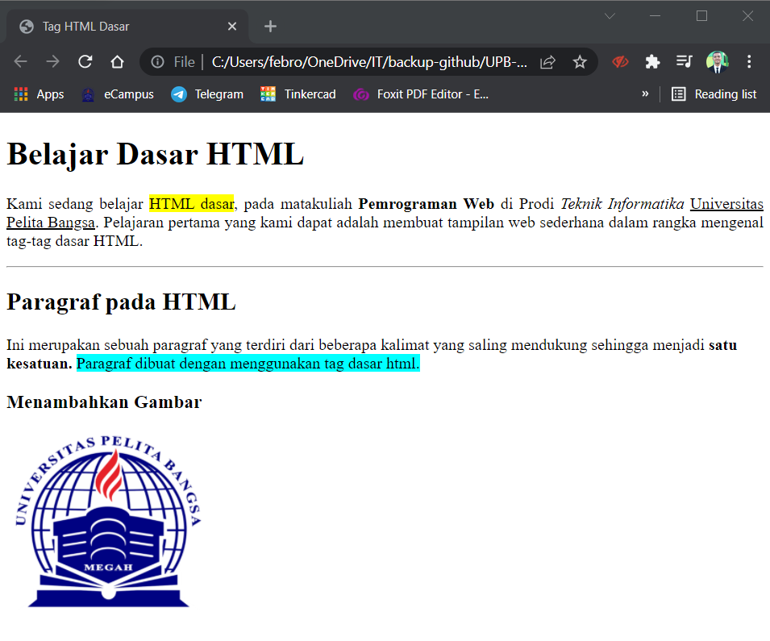
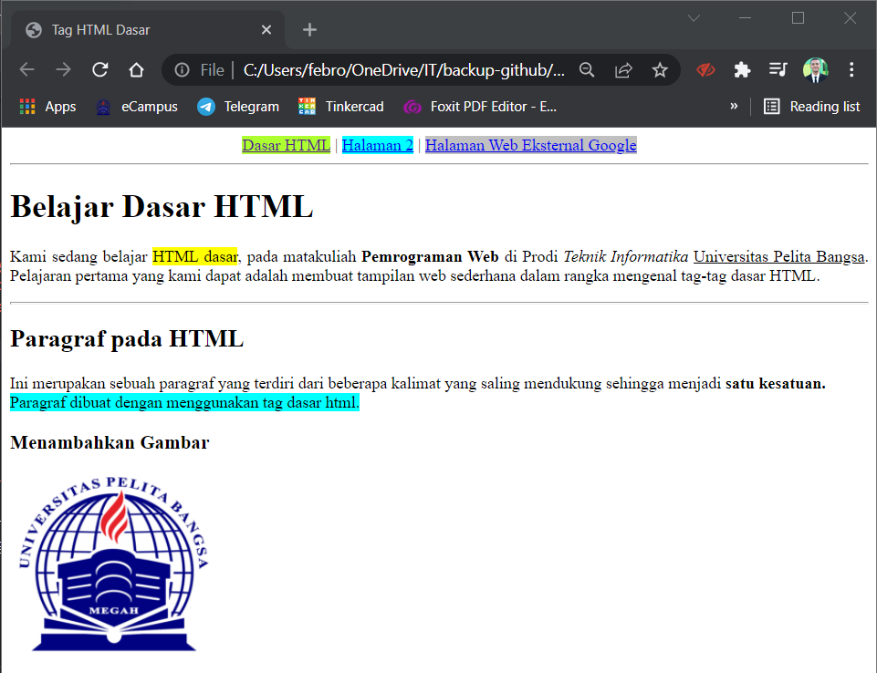

# Pemrograman Web - Pertemuan 2
<br>

**File : lab1_tag_dasar.html**


Langkah pertama untuk membuat tugas ini adalah membuat file baru dengan nama : *lab1_tag_dasar* 
```
<!DOCTYPE html>
<head>
    <title>Tag HTML Dasar</title>
</head>
<body>
    
</body>
</html>
```

Dibawah ini adalah hasil dari source code tersebut : <br>
 <br>
Terlihat title pada tab browser berubah menjadi **Tag HTML Dasar**

1. **Membuat Paragraf** 
<br>
Pada bagian \<body> .... \</body> akan saya tambahkan paragraf, seperti berikut ini : 
```
<!-- Ini adalah paragraf pertama -->
<p>Kami sedang belajar HTML dasar, pada matakuliah Pemrograman Web di Prodi Teknik Informatika Universitas Pelita Bangsa. Pelajaran pertama yang kami dapat adalah membuat tampilan web sederhana dalam rangka mengenal tag-tag dasar HTML.</p>

<!-- Ini adalah paragraf kedua -->
<p>Ini merupakan sebuah paragraf yang terdiri dari beberapa kalimat yang saling mendukung sehingga menjadi satu kesatuan. Paragraf dibuat dengan menggunakan tag dasar html.</p>
```
<br>
Berikut adalah hasil setelah saya tambahkan paragraf baru



- **Merubah Perataan Paragraf** 
<br>
Setelah berhasil membuat paragraf baru, kali ini saya akan membuat perataan paragraf ke tengah dan kanan. Source code yang sudah ada akan saya rubah menjadi :
```
<!-- Ini adalah paragraf pertama -->
<p align="center">Kami sedang belajar HTML dasar, pada matakuliah Pemrograman Web di Prodi Teknik Informatika Universitas Pelita Bangsa. Pelajaran pertama yang kami dapat adalah membuat tampilan web sederhana dalam rangka mengenal tag-tag dasar HTML.</p>
<!-- Ini adalah paragraf kedua -->
<p align="right">Ini merupakan sebuah paragraf yang terdiri dari beberapa kalimat yang saling mendukung sehingga menjadi satu kesatuan. Paragraf dibuat dengan menggunakan tag dasar html.</p>
```
<br>

Berikut tampilannya akan terlihat paragraf pertama menjadi rata tengah, dan paragraf kedua menjadi rata kanan :



<br>

2. **Menambahkan Judul**
Setelah membuat paragraf, saatnya kita membuat Judul pada sebuah halaman Website. Yaitu menggunakan Heading.
Saya akan menambahkan tag heading pada tiap-tiap paragraf.

```
<!-- judul paragraf pertama -->
<h1>Belajar Dasar HTML</h1>
<!-- Ini adalah paragraf pertama -->
<p align="center">Kami sedang belajar HTML dasar, pada matakuliah Pemrograman Web di Prodi Teknik Informatika Universitas Pelita Bangsa. Pelajaran pertama yang kami dapat adalah membuat tampilan web sederhana dalam rangka mengenal tag-tag dasar HTML.</p>

<!-- judul paragraf kedua -->
<h2>Paragraf pada HTML</h2>
<!-- Ini adalah paragraf kedua -->
<p align="right">Ini merupakan sebuah paragraf yang terdiri dari beberapa kalimat yang saling mendukung sehingga menjadi satu kesatuan. Paragraf dibuat dengan menggunakan tag dasar html.</p>
```

Berikut hasil dari source code yang sudah diperbarui :



Dari paragraf kedua masih berada pada rata kanan, kita akan mencoba ubah menjadi rata kiri. Dengan source code berikut :

```
<p align="left">Ini merupakan sebuah paragraf yang terdiri dari beberapa kalimat yang saling mendukung sehingga menjadi satu kesatuan. Paragraf dibuat dengan menggunakan tag dasar html.</p>
```

Dan akan berubah seperti ini :


3. **Memformat Teks Paragraf**
<br> 
Setelah melakukan perataan pada sebuah paragraf, saya akan melakukan modifikasi terhadap paragaf tersebut. Yaitu dengan merubah *background* pada beberapa kata, membuat huruf tebal, huruf miring, dan bergaris bawah.<br>
Saya telah melakukan perubahan perataan kanan-kiri / *justify* pada Paragraf 1 dan Rata kiri untuk Paragraf kedua.
<br>
Berikut perubahan pada *source code* yang telah saya buat pada tag \<body>. :

```
<!-- judul paragraf pertama -->
<h1>Belajar Dasar HTML</h1>
<!-- Ini adalah paragraf pertama -->
<p align="justify">Kami sedang belajar <font style="background-color: yellow;">HTML dasar</font>, pada matakuliah <b>Pemrograman Web</b> di Prodi <i>Teknik Informatika</i> <u>Universitas Pelita Bangsa</u>. Pelajaran pertama yang kami dapat adalah membuat tampilan web sederhana dalam rangka mengenal tag-tag dasar HTML.</p>

<hr>
<!-- judul paragraf kedua -->
<h2>Paragraf pada HTML</h2>
<!-- Ini adalah paragraf kedua -->
<p align="left">Ini merupakan sebuah paragraf yang terdiri dari beberapa kalimat yang saling mendukung sehingga menjadi <b>satu kesatuan.</b> <font style="background-color: aqua;">Paragraf dibuat dengan menggunakan tag dasar html.</font></p>
```

Dan berikut adalah hasil dari *source code* diatas : <br>



4. **Menyisipkan Gambar**
<br>
Pada Bagian ketiga, saya ingin menambahkan gambar di file HTML yang telah dibuat, yaitu logo Universitas Pelita Bangsa dengan ukuran 200 x 180 px. <br>

Berikut *source code* yang saya tambahkan : 
<br>

```
<h3>Menambahkan Gambar</h3>


```

Setelah melakukan perubahan, berikut adalah hasilnya. <br>


5. **Menambahkan Hyperlink**
<br>

Poin ke-lima saya ingin menambahkan hyperlink pada file HTML yang sudah dibuat. yaitu **Dasar HTML** yang akan menampilkan halaman 2 paragraf belajar Dasar HTML. <br>
Pada menu / hyperlink **Halaman 2** akan menampilkan *Jawaban pada pertanyaan yang ada pada modul Praktikum* <br>
Sedangkan pada hyperlink **Halaman Web Eksternal Google** akan menampilkan *Home Page Google Indonesia*  <br>
*Source code* yang sudah saya tulis sebagai berikut :
<br>

```
<div align="center">
<a href="lab1_tag_dasar.html" style="background-color: greenyellow;">Dasar HTML</a> | <a href="lab1_halaman2.html" style="background-color: aqua;">Halaman 2</a> | <a href="https://google.co.id" style="background-color: silver;">Halaman Web Eksternal Google</a>
</div>
<hr>
```

Dan berikut adalah preview dari *Source code* yang sudah saya edit. <br>
