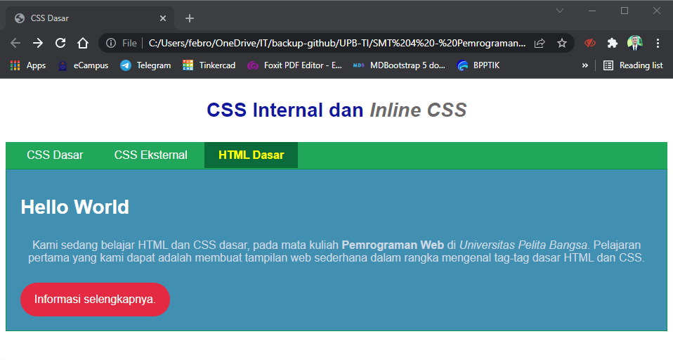
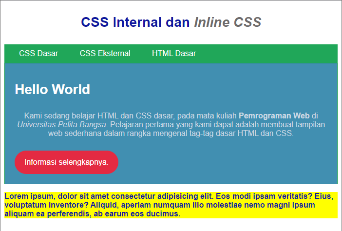

# Pemrograman Web - Pertemuan 3
<br>

| Nama | Febro Herdyanto |
| --- | --- |
| NIM | 312010043 |
| Kelas | TI.20.B.1 |
| Mata Kuliah | Pemrograman Web |

<hr>

Pada repository ini saya akan melanjutkan tugas mengenai CSS Dasar. <br>

### 1. **Membuat Dokumen HTML**
<br>
Pada langkah awal, saya membuat file HTML yang berisi source code seperti berikut : <br>

```
<!DOCTYPE html>
<html lang="en">
<head>
    <meta charset="UTF-8">
    <meta http-equiv="X-UA-Compatible" content="IE=edge">
    <meta name="viewport" content="width=device-width, initial-scale=1.0">
    <title>CSS Dasar</title>
</head>
<body>
    <header>
        <h1>CSS Internal dan <i>Inline CSS</i></h1>
    </header>
    <nav>
        <a href="lab2_css_dasar.html">CSS Dasar</a>
        <a href="lab2_css_eksternal.html">CSS Eksternal</a>
        <a href="lab1_tag_dasar.html">HTML Dasar</a>
    </nav>

    <!-- CSS ID Selector -->
    <div id="intro">
        <h1>Hello World</h1>
        <p>Kami sedang belajar HTML dan CSS dasar, pada mata kuliah <b>Pemrograman Web</b> di <i>Universitas Pelita Bangsa</i>. Pelajaran pertama yang kami dapat adalah membuat tampilan web sederhana dalam rangka mengenal tag-tag dasar HTML dan CSS.</p>
        <!-- CSS Class Selector -->
        <a class="button btn-primary" href="#intro">Informasi selengkapnya.</a>
    </div>
    </body>
</html>
```

Hasil pada source code tersebut adalah seperti gambar dibawah ini : <br>


### 2. **Mendeklarasikan CSS Internal**

Pada poin kedua ini saya ingin menambahkan CSS Internal pada file HTML yang sudah dibuat. Yaitu dengan menambahkan tag css didalam tag head. Source code yang dibuat adalah seperti berikut : <br>

```
    <style>
        body{
            font-family: "Open Sans", sans-serif;
        }
        header{
            min-height: 80px;
            border-bottom: 1px, solid #77ccef;
        }
        h1{
            font-size: 24px;
            color: #0f189f;
            text-align: center;
            padding: 20px 10px;
        }
        h1 i{
            color: #6d6a6b;
        }
    </style>
```

Hasil pada source code diatas seperti gambar dibawah ini. <br>


### 3. **Menambahkan CSS Inline**

Poin ketiga ini saya menambahkan css inline pada tag paragraf yang telah dibuat sebelumnya. <br>
Sebelumnya : <br>

```
<p>Kami sedang belajar HTML dan CSS dasar, pada mata kuliah <b>Pemrograman Web</b> di <i>Universitas Pelita Bangsa</i>. Pelajaran pertama yang kami dapat adalah membuat tampilan web sederhana dalam rangka mengenal tag-tag dasar HTML dan CSS.</p>
```

Menjadi seperti ini <br>

```
<p style="text-align: center; color: #ccd8e4;">Kami sedang belajar HTML dan CSS dasar, pada mata kuliah <b>Pemrograman Web</b> di <i>Universitas Pelita Bangsa</i>. Pelajaran pertama yang kami dapat adalah membuat tampilan web sederhana dalam rangka mengenal tag-tag dasar HTML dan CSS.</p>
```

Berikut perubahan yang akan terjadi : <br>


### 4. **Membuat CSS Eksternal**

Poin keempat, saya melakukan update pada ektsernal css. Yaitu dengan memberikan warna pada navbar dengan nama file **style_eksternal.css** . Berikut adalah source code pada file css eksternal.<br>

```
nav{
    background: #20a759;
    color: #fff;
    padding: 10px;
}
nav a{
    color: #fff;
    text-decoration: none;
    padding: 10px 20px;
}
nav .active,
nav a:hover{
    background: #0b6b3a;
}
```

kemudian saya juga menambahkan link didalam tag head di file lab2_css_dasar.html. Berikut source code nya : <br>

```
<link rel="stylesheet" href="style_eksternal.css" type="text/css">
```

Berikut tampilan yang akan berubah ketika kita save dan refresh pada halaman web.


### 5. **Menambahkan CSS Selector**

Poin kelima saya ingin menambahkan dan memodifikasi file style_eksternal.css dengan cara mengubah file atau id dan class selector. <br>
Berikut source code yang telah saya tambahkan pada file css. <br>

```
/* ID Selector */
#intro{
    background: #418fb1;
    border: 1px solid #099249;
    min-height: 100px;
    padding: 10px;
}
#intro h1{
    text-align: left;
    border: 0;
    color: #fff;
}

/* Class Selector */
.button{
    padding: 15px 20px;
    background: #bebcbd;
    color: #fff;
    display: inline-block;
    margin: 10px;
    text-decoration: none;
}
.btn-primary{
    background: #e42a42;
}
```

Dan akan berubah seperti tampilan berikut : <br>


### Pertanyaan dan Tugas
<br>

> 1. Lakukan eksperimen dengan mengubah dan menambah properti dan nilai pada kode CSS dengan mengacu pada CSS Cheat Sheet yang diberikan pada file terpisah dari modul ini. <br>
> 2. Apa perbedaan pendeklarasian CSS elemen h1 {...} dengan #intro h1 {...}? berikan penjelasannya! <br>
> 3. Apabila ada deklarasi CSS secara internal, lalu ditambahkan CSS eksternal dan inline CSS pada elemen yang sama. Deklarasi manakah yang akan ditampilkan pada browser? Berikan penjelasan dan contohnya! <br>
> 4. Pada sebuah elemen HTML terdapat ID dan Class, apabila masing-masing selector tersebut terdapat deklarasi CSS, maka deklarasi manakah yang akan ditampilkan pada browser? Berikan penjelasan dan contohnya! ( \<p id="paragraf-1" class="text-paragraf"> )  <br>

### Jawaban
<br>

> 1. Saya telah melakukan beberapa perubahan, yaitu  dengan mengubah button menjadi oval dengan menggunakan border-radius, navbar ketika active dan hover akan berubah menjadi tebal dan text berwarna kuning, mengubah padding pada intro. <br>
> Berikut adalah source codenya : <br>

**file : style_eksternal.css**

```
nav{
    background: #20a759;
    color: #fff;
    padding: 10px;
}
nav a{
    color: #fff;
    text-decoration: none;
    padding: 10px 20px;
}
nav .active,
nav a:hover{
    background: #0b6b3a;
    font-weight: bold;
    color: yellow;
}

/* ID Selector */
#intro{
    background: #418fb1;
    border: 1px solid #099249;
    min-height: 100px;
    padding: 10px;
    text-align: justify;
}
#intro h1{
    text-align: left;
    border: 0;
    color: #fff;
}

/* Class Selector */
.button{
    padding: 15px 20px;
    background: #bebcbd;
    color: #fff;
    display: inline-block;
    margin: 10px;
    text-decoration: none;
    border-radius: 25px;
}
.btn-primary{
    background: #e42a42;
}
```

<br>

**file : lab2_css_dasar.html**

```
<!DOCTYPE html>
<html lang="en">
<head>
    <meta charset="UTF-8">
    <meta http-equiv="X-UA-Compatible" content="IE=edge">
    <meta name="viewport" content="width=device-width, initial-scale=1.0">
    <title>CSS Dasar</title>

    <link rel="stylesheet" href="style_eksternal.css" type="text/css">
    <style>
        body{
            font-family: "Open Sans", sans-serif;
        }
        header{
            min-height: 40px;
            border-bottom: 1px, solid #77ccef;
        }
        h1{
            font-size: 28px;
            color: #0f189f;
            text-align: center;
            padding: 10px 10px;
        }
        h1 i{
            color: #6d6a6b;
        }
    </style>

</head>
<body>
    <header>
        <h1>CSS Internal dan <i>Inline CSS</i></h1>
    </header>
    <nav>
        <a href="lab2_css_dasar.html">CSS Dasar</a>
        <a href="lab2_css_eksternal.html">CSS Eksternal</a>
        <a href="lab1_tag_dasar.html">HTML Dasar</a>
    </nav>

    <!-- CSS ID Selector -->
    <div id="intro">
        <h1>Hello World</h1>
        <p style="text-align: center; color: #ccd8e4;">Kami sedang belajar HTML dan CSS dasar, pada mata kuliah <b>Pemrograman Web</b> di <i>Universitas Pelita Bangsa</i>. Pelajaran pertama yang kami dapat adalah membuat tampilan web sederhana dalam rangka mengenal tag-tag dasar HTML dan CSS.</p>
        <!-- CSS Class Selector -->
        <a class="button btn-primary" href="#intro">Informasi selengkapnya.</a>
    </div>
    </body>
</html>
```

<br>

Berikut adalah tampilan ketika telah saya modifikasi : <br>



> 2. Perbedaan pada deklarasi h1{...} adalah untuk memodifikasi dalam tag h1 umum atau bisa dipakai pada tag header. Sedangkan #intro h1{...} untuk memodifikasi pada heading 1 yang terdapat didalam tag intro. <br>
> 3. CSS Inline yang akan dibaca dan ditampilkan pertama kali pada browser. Karena CSS Inline lebih ringan ditampilkan dalam sebuah file HTML. <br>
> 4. Setelah saya melakukan percobaan menggunakan deklarasi ID dan Class pada sebuah tag HTML dan CSS. Deklarasi yang akan ditampilkan adalah deklarasi ID. Berikut saya memberikan contoh <br>

Saya menambahkan tag HTML seperti dibawah ini pada file lab2_css_dasar.html

```
<style>
        .cprg{
            color: red;
            background-color: cyan;
            font-weight: bold;
        }
        #prg{
            color: #0f189f;
            background-color: yellow;
        }
</style>


    <div class="cprg" id="prg">
        <p>Lorem ipsum, dolor sit amet consectetur adipisicing elit. Eos modi ipsam veritatis? Eius, voluptatum inventore? Aliquid, aperiam numquam illo molestiae nemo magni ipsum aliquam ea perferendis, ab earum eos ducimus.</p>
    </div>
```

Dan hasil yang akan ditampilkan adalah sebagai berikut. Deklarasi ID pada css akan ditampilkan di browser daripada class. <br>

