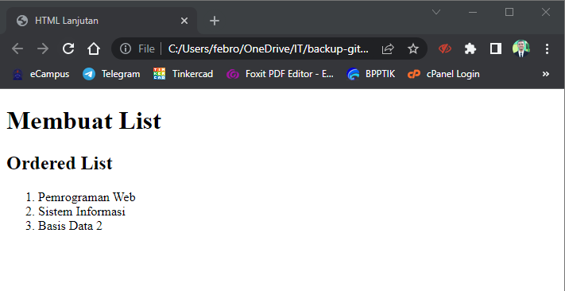
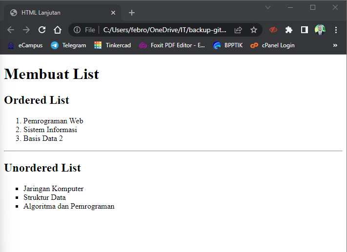
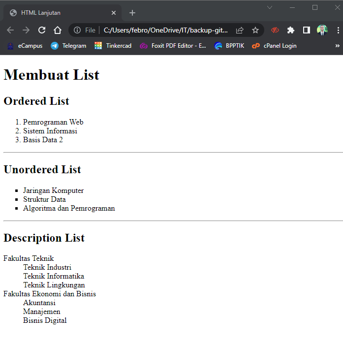
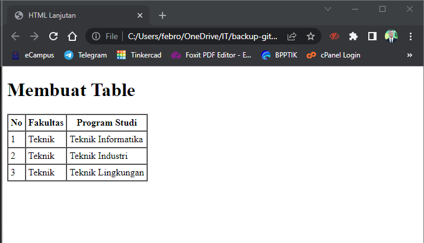
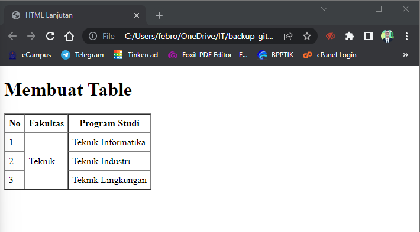
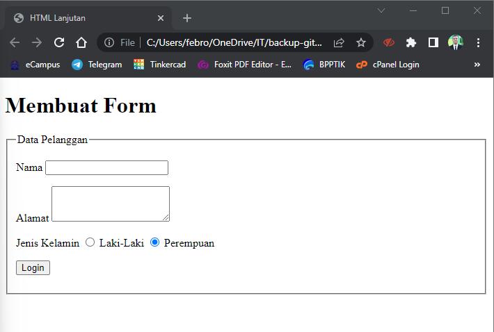

# Tugas Pemrograman Web - Pertemuan 4

<hr>

| Nama | Febro Herdyanto |
| --- | --- |
| NIM | 312010043 |
| Kelas | TI.20.B.1 |
| Mata Kuliah | Pemrograman Web |
| Dosen | Agung Nugroho,S.Kom.,M.Kom |

<hr>

## Daftar Isi
| No | Judul | Link |
| --- | --- | --- |
| 1 | Ordered List | [Click Here](#) |
| 2 | Unordered List | [Click Here](#) |
| 3 | Description List | [Click Here](#) |
| 4 | Table | [Click Here](#) |
| 5 | Forms | [Click Here](#) |
| 6 | Pertanyaan Modul | [Click Here](#pertanyaan) |
| 7 | Jawaban Modul | [Click Here](#jawaban) |

<hr>

## `Uraian Tugas`

### **Ordered List**

1. **Ordered List** <br>
Sesuai dengan tugas yang berikan oleh Dosen Mata Kuliah Pemrograman Web, pada poin pertama kami diminta untuk membuat Tag HTML yaitu **Ordered List** . Saya menuliskan syntax berikut pada file *lab3_list.html* <br>

```
<!DOCTYPE html>
<html lang="en">
<head>
    <meta charset="UTF-8">
    <meta http-equiv="X-UA-Compatible" content="IE=edge">
    <meta name="viewport" content="width=device-width, initial-scale=1.0">
    <title>HTML Lanjutan</title>
</head>
<body>

    <header>
        <h1>Membuat List</h1>
    </header>

    <section id="order_list">
        <h2>Ordered List</h2>
        <ol>
            <li>Pemrograman Web</li>
            <li>Sistem Informasi</li>
            <li>Basis Data 2</li>
        </ol>
    </section>

</body>
</html>
```

Hasil eksekusi dari file HTML tersebut akan menampilkan output sebagai berikut : <br>



### **Unordered List**

2. **Unordered List** <br>
Setelah melakukan percobaan pada ordered list, pada poin kedua ini kami diminta untuk membuat tag HTML unordered list. Pada file *lab3_list.html* saya menambahkan beberapa syntax, bisa dilihat seperti berikut : <br>

```
    <section id="unorder-list">
        <h2>Unordered List</h2>
        <ul type="square">
            <li>Jaringan Komputer</li>
            <li>Struktur Data</li>
            <li>Algoritma dan Pemrograman</li>
        </ul>
    </section>
```

Setelah melakukan save pada file HTML, hasil eksekusi file tersebut akan menampilkan output seperti : <br>



### **Description List**

3. **Description List** <br>
Langkah berikutnya, kami diminta untuk membuat tag HTML, yaitu Description List. Saya menambahkan beberapa syntax HTML pada file **lab3_list.html** <br>

```
    <section id="desc-list">
        <h2>Description List</h2>
        <dl>
            <dt>Fakultas Teknik</dt>
                <dd>Teknik Industri</dd>
                <dd>Teknik Informatika</dd>
                <dd>Teknik Lingkungan</dd>
            <dt>Fakultas Ekonomi dan Bisnis</dt>
                <dd>Akuntansi</dd>
                <dd>Manajemen</dd>
                <dd>Bisnis Digital</dd>
        </dl>
    </section>
```

Hasil eksekusi dari syntax terbaru Description List yang saya buat, akan menampilkan output seperti berikut :



### **Table**

* **Membuat Table** <br>
Setelah mengenal beberapa macam list yang digunakan pada HTML, selanjutnya saya akan membahas mengenai **Table** pada file HTML. <br>
Saya akan membuat file HTML baru dengan nama **lab3_tabel.html** , kemudian saya isi source code HTML seperti berikut. <br>

```
<!DOCTYPE html>
<html lang="en">
<head>
    <meta charset="UTF-8">
    <meta http-equiv="X-UA-Compatible" content="IE=edge">
    <meta name="viewport" content="width=device-width, initial-scale=1.0">
    <title>HTML Lanjutan</title>
</head>
<body>

    <header>
        <h1>Membuat Table</h1>
    </header>

    <table border="1" cellpadding="4" cellspacing="0">
        <thead>
            <tr>
                <th>No</th>
                <th>Fakultas</th>
                <th>Program Studi</th>
            </tr>
        </thead>
        <tbody>
            <tr>
                <td>1</td>
                <td>Teknik</td>
                <td>Teknik Informatika</td>
            </tr>
            <tr>
                <td>2</td>
                <td>Teknik</td>
                <td>Teknik Industri</td>
            </tr>
            <tr>
                <td>3</td>
                <td>Teknik</td>
                <td>Teknik Lingkungan</td>
            </tr>
        </tbody>
    </table>

</body>
</html>
```

Penjelasan pada source code diatas adalah untuk membuat table harus diawali dengan tag HTML \<table> dan diakhiri oleh \</table>. Sedangkan saya mengatur margin dan padding pada cell data, yaitu dengan menambahkan atribut **cellpadding="4"** dan **cellspacing="0"**. Dan akan menghasilkan output seperti berikut. <br>



* **Table - Menggabungkan Sel Data** <br>
Setelah membuat table pada HTML selesai, kali ini saya akan membuat modul untuk menggabungkan baris pada table tersebut. Disini saya menggunakan tag **rowspan**. Rowspan digunakan untuk menggabungkan beberapa baris pada table HTML. Selain rowspan, saya juga melakukan perubahan pada *cellpadding* menjadi 6. Berikut source code yang saya ubah. <br>

```
    <table border="1" cellpadding="6" cellspacing="0">
        <thead>
            <tr>
                <th>No</th>
                <th>Fakultas</th>
                <th>Program Studi</th>
            </tr>
        </thead>
        <tbody>
            <tr>
                <td>1</td>
                <td rowspan="3">Teknik</td>
                <td>Teknik Informatika</td>
            </tr>
            <tr>
                <td>2</td>
                <td>Teknik Industri</td>
            </tr>
            <tr>
                <td>3</td>
                <td>Teknik Lingkungan</td>
            </tr>
        </tbody>
    </table>
```

Setelah source code tersebut di eksekusi, akan menampilkan output sebagai berikut. <br>


### **Forms**

* **Membuat Form** <br>
Pada poin ini saya akan membuat tutorial sederhana mengenai pembuatan form pada HTML. Disini saya akan membuat file baru dengan nama **lab3_form.html** dan mengisikan beberapa source code. <br>

```
<!DOCTYPE html>
<html lang="en">
<head>
    <meta charset="UTF-8">
    <meta http-equiv="X-UA-Compatible" content="IE=edge">
    <meta name="viewport" content="width=device-width, initial-scale=1.0">
    <title>HTML Lanjutan</title>
</head>
<body>
    
    <header>
        <h1>Membuat Form</h1>
    </header>

    <form action="proses.php" method="post">
        <fieldset>
            <legend>Data Pelanggan</legend>
            <p>
                <label for="nama">Nama</label>
                <input type="text" id="nama" name="nama">
            </p>
            <p>
                <label for="alamat">Alamat</label>
                <textarea id="alamat" name="alamat" cols="20" rows="3"></textarea>
            </p>
            <p>
                <label>Jenis Kelamin</label>
                <input type="radio" id="jk_l" name="kelamin" value="L">
                    <label for="jk_l">Laki-Laki</label>
                <input type="radio" id="jk_p" name="kelamin" value="P">
                    <label for="jk_p">Perempuan</label>
            </p>
            <p>
                <input type="submit" value="Login">
            </p>
        </fieldset>
    </form>

</body>
</html>
```

Setelah file tersebut disimpan dan dibuka, akan menampilkan output seperti berikut. <br>


* **Modifikasi Tampilan Form** <br>
