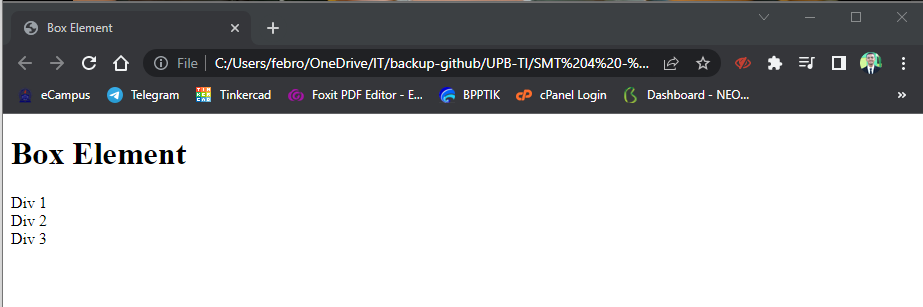

# Tugas Pemrograman Web - Pertemuan 5

<hr>

| Nama | Febro Herdyanto |
| --- | --- |
| NIM | 312010043 |
| Kelas | TI.20.B.1 |
| Mata Kuliah | Pemrograman Web |
| Dosen | Agung Nugroho,S.Kom.,M.Kom |

<hr>

## Daftar Isi

| No | Judul | Link |
| --- | --- | --- |
| 1 | Membuat Box Element | [Click Here](#membuat-box-element) |
| 2 | Menambahkan CSS Float Property | [Click Here](#menambahkan-css-float-property) |

## `Uraian Tugas`

### **Membuat Box Element**

Disini saya akan menjelaskan tentang cara membuat box element. Saya akan membuat file *lab4_box.html* dan mengisikan beberapa syntax, berikut adalah code-nya. 

```
<!DOCTYPE html>
<html lang="en">
<head>
    <meta charset="UTF-8">
    <meta http-equiv="X-UA-Compatible" content="IE=edge">
    <meta name="viewport" content="width=device-width, initial-scale=1.0">
    <title>Box Element</title>
</head>
<body>

<header>
    <h1>Box Element</h1>
</header>

<section>
    <div class="div1">Div 1</div>
    <div class="div2">Div 2</div>
    <div class="div3">Div 3</div>
</section>

</body>
</html>
```

Hasil dari code tersebut akan memberikan output seperti dibawah ini : <br>
 <br>

### **Menambahkan CSS Float Property**

Tampilan diatas adalah tampilan dasar, sehingga kita harus menambahkan beberapa css untuk mempercantik tampilannya. Dengan itu saya menambahkan beberapa syntax css, berikut code-nya. 

```
    <style>
        div {
        float:left;
        padding: 10px;
        }
        .div1 {
        background: red;
        }
        .div2 {
        background: yellow;
        }
        .div3 {
        background: green;
        }
    </style>
```

Setelah css ditambahkan, berikut adalah hasil tampilannya. <br>
