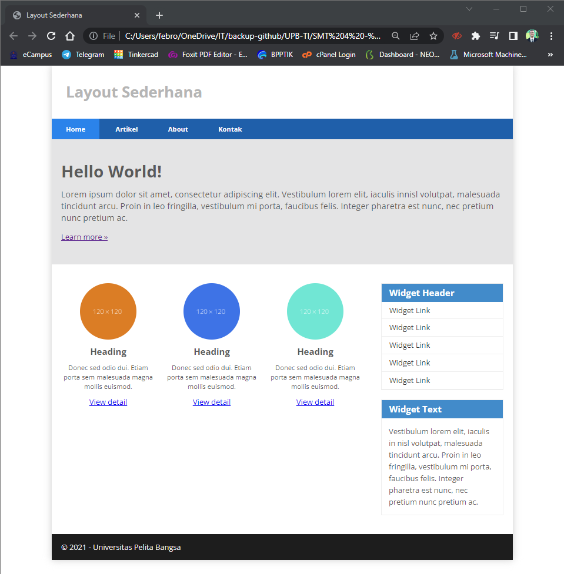
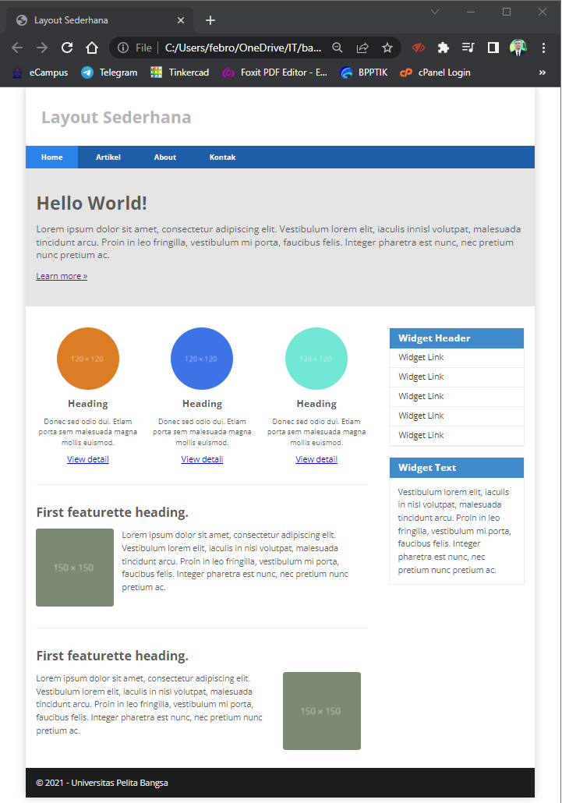

## Layout Sederhana - Febro Herdyanto
<hr>

| Nama | Febro Herdyanto |
| --- | --- |
| NIM | 312010043 |
| Kelas | TI.20.B.1 |
| Mata Kuliah | Pemrograman Web |
| Dosen | Agung Nugroho,S.Kom.,M.Kom |

<hr>

## Daftar Isi

| No | Judul | Link |
| --- | --- | --- |
| 1 | Membuat HTML File | [Click Here](#membuat-file-html) |
| 2 | Menambahkan CSS Pada Home | [Click Here](#menambahkan-css-pada-home) |
| 3 | Membuat Navigasi | [Click Here](#membuat-navigasi) |
| 4 | Membuat Hero Panel | [Click Here](#membuat-hero-panel) |
| 5 | Mengatur Layout Main dan Sidebar | [Click Here](#mengatur-layout-main--sidebar) |
| 6 | Membuat Sidebar Widget | [Click Here](#membuat-sidebar-widget) |
| 7 | Mengatur Footer | [Click Here](#mengatur-footer) |
| 8 | Menambahkan Elemen pada Main Content | [Click Here](#menambahkan-element-pada-main-content) |
| 9 | Menambahkan Content Artikel | [Click Here](#menambahkan-content-artikel) |
| 10 | Pertanyaan dan Tugas | [Click Here](#pertanyaan-dan-tugas) |
| 11 | Jawaban dari Tugas | [Click Here](#jawaban-dari-tugas) |


## `Uraian Tugas`

### **Membuat File HTML** 

Langkah pertama dalam **Layout Sederhana** saya akan membuat file HTML dengan nama *home.html* dengan beberapa code html seperti dibawah ini : 

```
<!DOCTYPE html>
<html lang="en">
<head>
    <meta charset="UTF-8">
    <meta http-equiv="X-UA-Compatible" content="IE=edge">
    <meta name="viewport" content="width=device-width, initial-scale=1.0">
    <title>Layout Sederhana</title>
</head>
<body>

<div id="container">
    <header>
        <h1>Layout Sederhana</h1>
    </header>
    <nav>
        <a href="home.html" class="active">Home</a>
        <a href="artikel.html">Artikel</a>
        <a href="about.html">About</a>
        <a href="kontak.html">Kontak</a>
    </nav>
    <section id="hero"></section>
    <section id="wrapper">
        <section id="main"></section>
        <aside id="sidebar"></aside>
    </section>
    <footer>
        <p>&copy; 2021 - Universitas Pelita Bangsa</p>
    </footer>
</div>
    
</body>
</html>
```

Hasil dari syntax tersebut adalah seperti dibawah ini. <br>


### **Menambahkan CSS Pada Home**

Setelah file HTML berhasil dibuat, maka saya akan menambahkan css untuk mempercantiknya. Dengan cara membuat file CSS : *style.css* dengan beberapa syntax seperti dibawah ini.

```
/* import google font */
@import
url('https://fonts.googleapis.com/css2?family=Open+Sans:ital,wght@0,300;0,400;0,600;0,700;0,800;1,300;1,400;1,600;1,700;1,800&display=swap');
@import
url('https://fonts.googleapis.com/css2?family=Open+Sans+Condensed:ital,wght@0,300;0,700;1,300&display=swap');
/* Reset CSS */
* {
    margin: 0;
    padding: 0;
}
body {
    line-height:1;
    font-size:100%;
    font-family:'Open Sans', sans-serif;
    color:#5a5a5a;
}
#container {
    width: 980px;
    margin: 0 auto;
    box-shadow: 0 0 1em #cccccc;
}
/* header */
header {
    padding: 20px;
}
header h1 {
    margin: 20px 10px;
    color: #b5b5b5;
}
```

Dan menambahkan tag untuk import css ke file HTML, yaitu :

```
<link rel="stylesheet" href="style.css">
```

Dan akan menampilkan output seperti berikut. <br>


### **Membuat Navigasi**

Saya akan mempercantik tampilan Navigasi menggunakan CSS. Berikut syntax yg saya masukkan.

```
/* navigasi */
nav {
    display: block;
    background-color: #1f5faa;
}
nav a {
    padding: 15px 30px;
    display: inline-block;
    color: #ffffff;
    font-size: 14px;
    text-decoration: none;
    font-weight: bold;
}
nav a.active,
nav a:hover {
    background-color: #2b83ea;
}
```

Hasil dari file tersebut kan seperti dibawah ini. <br>


### **Membuat Hero Panel**

Untuk membuat hero panel saya akan menambahkan beberapa syntax pada section id hero.

```
    <section id="hero">
        <h1>Hello World!</h1>
        <p>Lorem ipsum dolor sit amet, consectetur adipiscing elit. Vestibulum lorem elit, iaculis innisl volutpat, malesuada tincidunt arcu. Proin in leo fringilla, vestibulum mi porta, faucibus felis. Integer pharetra est nunc, nec pretium nunc pretium ac.</p>
        <a href="home.html" class="btn btn-large">Learn more &raquo;</a>
    </section>
```

Output dari isi section hero seperti berikut. <br>


**Mempercantik Tampilan Hero Panel** <br>
Tampilan diatas terlalu polos, saya akan memberikan beberapa syntax css.

```
/* Hero Panel */
#hero {
    background-color: #e4e4e5;
    padding: 50px 20px;
    margin-bottom: 20px;
}
#hero h1 {
    margin-bottom: 20px;
    font-size: 35px;
}
#hero p {
    margin-bottom: 20px;
    font-size: 18px;
    line-height: 25px;
}
```

Hasil dari CSS akan menampilkan seperti berikut <br>


### **Mengatur Layout Main & Sidebar**

Pada poin ini saya akan mengatur layout main dan sidebar dengan menambahkan beberapa syntax CSS.

```
/* main content */
#wrapper {
    margin: 0;
}
#main {
    float: left;
    width: 640px;
    padding: 20px;
}
/* sidebar area */
#sidebar {
    float: left;
    width: 260px;
    padding: 20px;
}
```

Berikut Hasilnya <br>


### **Membuat Sidebar Widget**

Langkah-langkah  membuat sidebar widget dengan menambahkan beberapa syntax HTML.

```
        <aside id="sidebar">
            <div class="widget-box">
                <h3 class="title">Widget Header</h3>
                <ul>
                    <li><a href="#">Widget Link</a></li>
                    <li><a href="#">Widget Link</a></li>
                    <li><a href="#">Widget Link</a></li>
                    <li><a href="#">Widget Link</a></li>
                    <li><a href="#">Widget Link</a></li>
                </ul>
            </div>
            <div class="widget-box">
                <h3 class="title">Widget Text</h3>
                <p>Vestibulum lorem elit, iaculis in nisl volutpat, malesuada tincidunt
                arcu. Proin in leo fringilla, vestibulum mi porta, faucibus felis. Integer
                pharetra est nunc, nec pretium nunc pretium ac.</p>
            </div>
        </aside>
```

Hasil dari code diatas seperti berikut. <br>


**Menambahkan Syntax CSS Pada Sidebar Widget**

Tampilan tersebut masih terlihat polos, makadari itu saya ingin menambahkan beberapa syntax CSS untuk mempercantiknya.

```
/* widget */
.widget-box {
    border:1px solid #eee;
    margin-bottom:20px;
}
.widget-box .title {
    padding:10px 16px;
    background-color:#428bca;
    color:#fff;
}
.widget-box ul {
    list-style-type:none;
}
.widget-box li {
    border-bottom:1px solid #eee;
}
.widget-box li a {
    padding:10px 16px;
    color:#333;
    display:block;
    text-decoration:none;
}
    .widget-box li:hover a {
    background-color:#eee;
}
.widget-box p {
    padding:15px;
    line-height:25px;
}
```

Berikut tampilan dari css tersebut. <br>


### **Mengatur Footer**

Dari footer yang telah dibuat sebelumnya, saya ingin membuat background pada footer tersebut, maka dari itu saya menambahkan beberapa syntax CSS.

```
/* footer */
footer {
    clear:both;
    background-color:#1d1d1d;
    padding:20px;
    color:#eee;
}
```

Hasil dari code tersebut adalah. <br>


### **Menambahkan Element pada Main Content**

Disini saya akan mengisi main content di halaman Home. Berikut syntax HTML yang saya masukkan.

```
        <section id="main">
            <div class="row">
                <div class="box">
                    
                    <h3>Heading</h3>
                    <p>Donec sed odio dui. Etiam porta sem malesuada magna mollis
                    euismod.</p>
                    <a href="#" class="btn btn-default">View detail</a>
                </div>
                <div class="box">
                    
                    <h3>Heading</h3>
                    <p>Donec sed odio dui. Etiam porta sem malesuada magna mollis
                    euismod.</p>
                    <a href="#" class="btn btn-default">View detail</a>
                </div>
                <div class="box">
                    
                    <h3>Heading</h3>
                    <p>Donec sed odio dui. Etiam porta sem malesuada magna mollis
                    euismod.</p>
                    <a href="#" class="btn btn-default">View detail</a>
                </div>
            </div>
        </section>
```

Hasil dari beberapa syntaxt HTML yang ditambahkan akan memberikan output seperti berikut. <br>


**Memodifikasi Tampilan Main Content**

Hasil dari tampilan diatas terlalu polos, maka dari itu saya ingin memodifikasinya. Saya menambahkan beberapa syntax CSS. 

```
/* box */
.box {
    display:block;
    float:left;
    width:33.333333%;
    box-sizing:border-box;
    -moz-box-sizing:border-box;
    -webkit-box-sizing:border-box;
    padding:0 10px;
    text-align:center;
}
.box h3 {
    margin: 15px 0;
}
.box p {
    line-height: 20px;
    font-size: 14px;
    margin-bottom: 15px;
}
box img {
    border: 0;
    vertical-align: middle;
}
.image-circle {
    border-radius: 50%;
}
.row {
    margin: 0 -10px;
    box-sizing: border-box;
    -moz-box-sizing: border-box;
    -webkit-box-sizing: border-box;
}
.row:after, .row:before,
.entry:after, .entry:before {
    content:'';
    display:table;
}
.row:after,
.entry:after {
    clear:both;
}
```

Hasil dari menambahkan syntax CSS tersebut adalah seperti dibawah ini. <br>


### **Menambahkan Content Artikel**

Pada poin terakhir saya akan menambahkan konten artikel pada menu Home. Berikut syntax HTML yang saya tambahkan.

```
    <section id="wrapper">
        <section id="main">
        ...
            <hr class="divider" />
            <article class="entry">
                <h2>First featurette heading.</h2>
                
                <p>Lorem ipsum dolor sit amet, consectetur adipiscing elit. Vestibulum lorem elit, iaculis in nisl volutpat, malesuada tincidunt arcu. Proin in leo fringilla, vestibulum mi porta, faucibus felis. Integer pharetra est nunc, nec pretium nunc pretium ac.</p>
            </article>
            <hr class="divider" />
            <article class="entry">
                <h2>First featurette heading.</h2>
                
                <p>Lorem ipsum dolor sit amet, consectetur adipiscing elit. Vestibulum lorem elit, iaculis in nisl volutpat, malesuada tincidunt arcu. Proin in leo fringilla, vestibulum mi porta, faucibus felis. Integer pharetra est nunc, nec pretium nunc pretium ac.</p>
            </article>
        
        ...
        </article>
    </article>
```

Hasil dari syntax HTML yang saya tambahkan seperti berikut. <br>


**Memodifikasi Content Artikel Dengan CSS**

Disini saya ingin mengubah tampilan content artikel dengan CSS. Berikut syntax CSS yang saya tambahkan.

```
...

.divider {
    border:0;
    border-top:1px solid #eeeeee;
    margin:40px 0;
    }
    /* entry */
    .entry {
    margin: 15px 0;
    }
    .entry h2 {
    margin-bottom: 20px;
}
.entry p {
    line-height: 25px;
}
.entry img {
    float: left;
    border-radius: 5px;
    margin-right: 15px;
}
.entry .right-img {
    float: right;
}

...
```

Setelah dilakukan simpan pada file CSS, berikut adalah hasilnya.


## **Pertanyaan dan Tugas**

> 1. Tambahkan Layout untuk menu About <br>
>    => buat single layout yang berisi deskripsi, portfolio, dll <br>
> 2. Tambahkan layout untuk menu Contact <br>
>    => yang berisi form isian: nama, email, message, dll <br>

## **Jawaban dari Tugas**

1. Saya telah membuat file **about.html** dan melakukan perubahan sesuai permintaan dosen, yaitu berisi tentang deskripsi dan portfolio saya dalam membuat Website. Berikut tampilan yang telah tersedia. <br>
