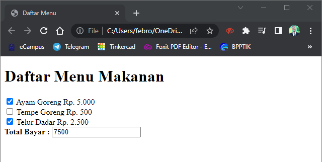

# Tugas Pemrograman Web - Pertemuan 6 - Javascript

<hr>

| Nama | Febro Herdyanto |
| --- | --- |
| NIM | 312010043 |
| Kelas | TI.20.B.1 |
| Mata Kuliah | Pemrograman Web |
| Dosen | Agung Nugroho,S.Kom.,M.Kom |

<hr>

## Daftar Isi

| No | Judul | Link |
| --- | --- | --- |
| 1 | Membuat Box Element | [Click Here](#membuat-box-element) |
| 2 | Menambahkan CSS Float Property | [Click Here](#menambahkan-css-float-property) |
| 3 | Mengatur Clearfix Element | [Click Here](#mengatur-clearfix-element) |


## `Uraian Tugas`

Halo semua!. Kali ini saya akan menjelaskan beberapa syntax HTML dengan Javascript, sesuai dengan perintah Dosen yang mengampu Mata Kuliah Pemrograman Web.

### `Pengenalan document.write dan console.log`

Materi pertama yang akan saya buat adalah pengenalan **document.write** dan **console.log**. Langkah pertama yang saya lakukan adalah membuat file baru dengan nama **lab5_javascript.html** dan memberikan code HTML dan Javascript yang telah saya buat.

```
<!DOCTYPE html>
<html lang="en">
<head>
    <meta charset="UTF-8">
    <meta http-equiv="X-UA-Compatible" content="IE=edge">
    <meta name="viewport" content="width=device-width, initial-scale=1.0">
    <title>Mengenal Javascript</title>
</head>
<body>

    <h1>Pengenalan Javascript</h1>
    <h3>Contoh document.write dan console.log</h3>

    <script type="text/javascript">
        document.write("Hello World");
        console.log("Hello World");
    </script>

</body>
</html>
```

Setelah file **lab5_javascript.html** saya simpan, dan akan menampilkan output seperti dibawah ini. <br>


### `Javascript Dasar`

#### `Javascript Alert`

Pada point ini saya akan menjelaskan mengenai Javascript Window Alert yang akan muncul pada browser. Saya akan membuat file baru dengan nama **js_alert.html**. Code yang akan saya buat adalah seperti berikut. 

```
<!DOCTYPE html>
<html lang="en">
<head>
    <meta charset="UTF-8">
    <meta http-equiv="X-UA-Compatible" content="IE=edge">
    <meta name="viewport" content="width=device-width, initial-scale=1.0">
    <title>Alert Box</title>
</head>
<body>
    
    <script language="javascript">
        <!--
            window.alert("Febro Herdyanto \nIni merupakan pesan untuk Anda !");
        //-->
    </script>

</body>
</html>
```

Hasil dari code tersebut akan memberikan output sebagai berikut. <br>


#### `Javascript Method`

Kali ini saya akan menjelaskna mengenai Javascript method. Saya akan membuat file baru dengan nama **jsMethod.html**. Dan beberikan source code HTML dan Javascript sebagai berikut.

```
<!DOCTYPE html>
<html lang="en">
<head>
    <meta charset="UTF-8">
    <meta http-equiv="X-UA-Compatible" content="IE=edge">
    <meta name="viewport" content="width=device-width, initial-scale=1.0">
    <title>Script Javascript</title>
</head>
<body>

    Percobaan memakai Javascript. <br>

    <script type="text/javascript">
        <!--
            document.write("Selamat mecoba Javascript <br>");
            document.write("Semoga Sukses!");
        //-->
    </script>

</body>
</html>
```

Hasil dari source code diatas akan beberikan output sebagai berikut. <br>


#### `Pemakaian Prompt`

Poin ini saya akan membuat file HTML baru dengan nama **jsPrompt.html** guna untuk menjelaskan beberapa pemakaian Prompt pada Javascript. Dan source code yang saya masukkan adalah sebagai berikut. 

```
<!DOCTYPE html>
<html lang="en">
<head>
    <meta charset="UTF-8">
    <meta http-equiv="X-UA-Compatible" content="IE=edge">
    <meta name="viewport" content="width=device-width, initial-scale=1.0">
    <title>Pemasukan Data</title>
</head>
<body>

    <script type="text/javascript">
        var nama = prompt("Siapa nama Anda?", "Masukkan nama Anda");
        document.write("Hai, " + nama + "!");
    </script>
</body>
</html>
```

Hasil ketika pertama kali saya me-load halaman tersebut akan menampilkan Alert untuk user memasukkan nama. <br>
 <br>
Setelah saya memasukkan nama **Febro Herdyanto** pada prompt tersebut, akan menampilkan halaman dengan isian : <br>


#### `Pembuatan Fungsi dan Cara Pemanggilannya`

Point ini saya akan membuat fungsi dan memanggil lewat body onload. Saya membuat file baru dengan nama **jsFunction.html** dan memberikan source code seperti berikut.

```
<!DOCTYPE html>
<html lang="en">
<head>
    <meta charset="UTF-8">
    <meta http-equiv="X-UA-Compatible" content="IE=edge">
    <meta name="viewport" content="width=device-width, initial-scale=1.0">
    <title>Contoh Program Javascript</title>
    <script type="text/javascript">
        function pesan(){
            alert("Memanggil Javascript lewat Body onload");
        }
    </script>
</head>
<body onload=pesan()>
    
</body>
</html>
```

Hasil dari source code tersebut adalah seperti gambar dibawah ini. <br>


<hr>

### `Dasar Pemrograman di Javascript`

#### `Operasi Dasar Aritmatika`

Didalam Javascript juga bisa digunakan untuk menghitung operasi dasar aritmatika. Disini saya akan mencobanya, dengan membuat file baru dengan nama **jsAritmatika.html** dan memberikan source code seperti berikut.

```
<!DOCTYPE html>
<html lang="en">
<head>
    <meta charset="UTF-8">
    <meta http-equiv="X-UA-Compatible" content="IE=edge">
    <meta name="viewport" content="width=device-width, initial-scale=1.0">
    <title>Contoh Program Javascript</title>
    <script type="text/javascript">
        function test (val1, val2){
            document.write("<br>"+"Perkalian : val1*val2 "+"<br>");
            document.write(val1*val2);
            document.write("<br>"+"Pembagian : val1/val2 "+"<br>");
            document.write(val1/val2);
            document.write("<br>"+"Penjumlahan : val1+val2 "+"<br>");
            document.write(val1+val2);
            document.write("<br>"+"Pengurangan : val1-val2 "+"<br>");
            document.write(val1-val2);
            document.write("<br>"+"Modulus : val1%val2 "+"<br>");
            document.write(val1%val2);
        }
    </script>
</head>
<body>
    
    <input type="button" name="button1" value="arithmetic" onclick="test(9,4)">
    
</body>
</html>
```

Hasil dari source tersebut, pertama kali akan menampilkan sebuah button. <br>
 <br>
Ketika button tersebut di klik akan menampilkan output seperti berikut. <br>


#### `Seleksi Kondisi (if-else)`

Pada point ini saya akan memberikan contoh statement condition pada Javascript. Dimana Jika nilai yang di input oleh user lebih dari samadengan 60, maka dinyatakan Lulus. Jika dibawah 60 akan mendapatkan hasil Tidak Lulus. Langkah selanjutnya saya akan membuat file HTML baru dengan nama **jsCondition.html** dengan source code seperti berikut. 

```
<!DOCTYPE html>
<html lang="en">
<head>
    <meta charset="UTF-8">
    <meta http-equiv="X-UA-Compatible" content="IE=edge">
    <meta name="viewport" content="width=device-width, initial-scale=1.0">
    <title>Contoh Kondisi If Else</title>
</head>
<body>
    
    <script type="text/javascript">
        var nilai = prompt("Nilai (0-100) : ", 0);
        var hasil = "";
        if(nilai >= 60)
            hasil = "Lulus";
        else
            hasil = "Tidak Lulus";
        
        document.write("Hasil : "+hasil);
    </script>
</body>
</html>
```

Hasil dari source code tersebut adalah akan menampilkan prompt untuk user memasukkan besaran nilai yang akan dicek oleh Javascript. <br>
 <br>
Selanjutnya saya akan melakukan pengecekan dengan memasukkan nilai **70** maka akan muncul Hasil Lulus seperti gambar dibawah ini. <br>
 <br>
Selain itu saya akan melakukan percobaan kembali untuk memasukkan nilai 50, maka akan muncul Hasil Tidak Lulus seperti gambar dibawah ini. <br>


#### `Penggunaan Operator Switch untuk Seleksi Kondisi`

Pada point ini saya akan memberikan contoh penggunaan switch untuk seleksi kondisi. Langkah pertama yaitu kita harus membuat file baru dengan nama **jsSwitch.html** dan memberikan / mengisikan source code seperti berikut. 

```
<!DOCTYPE html>
<html lang="en">
<head>
    <meta charset="UTF-8">
    <meta http-equiv="X-UA-Compatible" content="IE=edge">
    <meta name="viewport" content="width=device-width, initial-scale=1.0">
    <title>Javascript Switch</title>
    <script type="text/javascript">
        function test(){
            val1 = window.prompt("Input Nilai (1-5) : ");

            switch(val1){
                case "1" :
                    document.write("Bilangan Satu");
                    break;
                case "2" :
                    document.write("Bilangan Dua");
                    break;
                case "3" :
                    document.write("Bilangan Tiga");
                    break;
                case "4" :
                    document.write("Bilangan Empat");
                    break;
                case "5" :
                    document.write("Bilangan Lima");
                    break;
                default :
                    document.write("Bilangan Lainnya...");
            }
        }
    </script>
</head>
<body>
    
    <input type="button" name="button1" value="switch" onclick="test()">

</body>
</html>
```

Hasil dari source code tersebut akan menampilkan button switch untuk melakukan proses berikutnya. <br>
 <br>
Ketika kita melakukan klik pada button tersebut, maka window akan menampilkan prompt dimana meminta user agar mengisi form tersebut dengan angka 1-5. Disini saya mencoba mengisi dengan angka 3. <br>
 <br>
Setelah user mengisi angka 3, akan mendapatkan output seperti berikut . <br>
 <br>
Selain itu, saya juga melakukan percobaan untuk mengisi angka 10, dan hasil dari browser akan menampilkan seperti gambar dibawah ini. <br>


<hr>

### `Pembuatan Forms HTML`

#### `Form Input`

Pada Topik pembuatan Form HTML -Input ini saya akan memberikan contoh pada sebuah kolom untuk memberikan hasil apakah bilangan tersebut Ganjil atau Genap. Saya membuat file baru dengan nama **jsFormInput.html** dan mengisikan source code berikut.

```
<!DOCTYPE html>
<html lang="en">
<head>
    <meta charset="UTF-8">
    <meta http-equiv="X-UA-Compatible" content="IE=edge">
    <meta name="viewport" content="width=device-width, initial-scale=1.0">
    <title>Javascript Form Input</title>
    <script type="text/javascript">
        function test(){
            var val1 = document.kirim.T1.value;
            if(val1%2 == 0)
                document.kirim.T2.value="Bilangan Genap";
            else
                document.kirim.T2.val1="Bilangan Ganjil";
        }
    </script>
</head>
<body>

    <form method="post" name="kirim">
        <p>
            Bilangan <input type="text" name="T1" size="20">
            Merupakan Bilangan <input type="text" name="T2" size="20">
        </p>
        <p>
            <input type="button" value="TEBAK" name="B1" onclick="test()">
        </p>
    </form>
    
</body>
</html>
```

Hasil dari source code tersebut adalah seperti gambar dibawah ini, saya mencoba untuk memasukkan angka 8 pada kolom pertama. Dan hasil nya menampilkan Bilangan Genap. <br>


#### `Forms Button HTML`

Pada point ini saya akan memberikan contoh untuk perubahan background color pada file HTML menggunakan onclick dan function Javascript. Saya membuat file baru dengan nama **jsFormButton.html** dan memberikan source code seperti berikut.

```
<!DOCTYPE html>
<html lang="en">
<head>
    <meta charset="UTF-8">
    <meta http-equiv="X-UA-Compatible" content="IE=edge">
    <meta name="viewport" content="width=device-width, initial-scale=1.0">
    <title>Javascript Form Button</title>
</head>
<body>

    <script type="text/javascript">
        function ubahWarnaLB(warna){
            document.bgColor=warna;
        }
        function ubahWarnaLD(warna){
            document.fgColor = warna;
        }
    </script>

    <h1>Test</h1>
    <form method="post" action="">
        <input type="button" value="Latar Belakang Hijau" onclick="ubahWarnaLB('GREEN')">
        <input type="button" value="Latar Belakang Putih" onclick="ubahWarnaLB('WHITE')">
        <input type="button" value="Teks Kuning" onclick="ubahWarnaLD('YELLOW')">
        <input type="button" value="Teks Biru" onclick="ubahWarnaLD('BLUE')">
    </form>

</body>
</html>
```

Hasil pada source code tersebut adalah seperti gambar dibawah ini. <br>
 <br>
Saya akan mencoba klik button **Latar Belakang Hijau** , dan yang akan terjadi adalah background dari HTML tersebut berubah menjadi hijau. <br>
 <br>
Selanjutnya saya akan mencoba klik button **Latar Belakang Putih** , yang akan terjadi adalah background akan kembali seperti semula, yaitu warna putih. <br>
 <br>
Button **Teks Kuning** jika di klik akan mengubah font *Test* menjadi warna kuning. <br>
 <br>
Sedangkan button **Teks Biru** jika diklik akan mengubah text *Test* berubah menjadi warna Biru. <br>


<hr>

### `HTML DOM`

Pada point terakhir ini yaitu **HTML DOM** saya akan mencoba membuat Daftar Menu otomatis menggunakan Checkbox dan perhitungan otomatis.
Saya membuat file baru dengan nama **daftar_menu.html** dengan mengisi source code berikut. 

```
<!DOCTYPE html>
<html lang="en">
<head>
    <meta charset="UTF-8">
    <meta http-equiv="X-UA-Compatible" content="IE=edge">
    <meta name="viewport" content="width=device-width, initial-scale=1.0">
    <title>Daftar Menu</title>
    <script type="text/javascript">
        function hitung(ele){
            var total = document.getElementById('total').value;
                total = (total ? parseInt(total) : 0);
            var harga = 0;

            if (ele.checked){
                harga = ele.value;
                total += parseInt(harga);
            }else{
                harga = ele.value;
                if(total > 0)
                    total -= parseInt(harga);
            }

            document.getElementById('total').value = total;
        }
    </script>
</head>
<body>
    
    <h1>Daftar Menu Makanan</h1>

    <label>
        <input type="checkbox" value="5000" id="menu1" onclick="hitung(this)"> Ayam Goreng Rp. 5.000
    </label>
        <br>
    <label>
        <input type="checkbox" value="500" id="menu2" onclick="hitung(this)"> Tempe Goreng Rp. 500
    </label>
        <br>
    <label>
        <input type="checkbox" value="2500" id="menu3" onclick="hitung(this)"> Telur Dadar Rp. 2.500
    </label>
        <br>
    <strong>Total Bayar : <input type="text" id="total"></strong>

</body>
</html>
```

Hasil dari source code tersebut adalah seperti gambar dibawah ini. <br>
