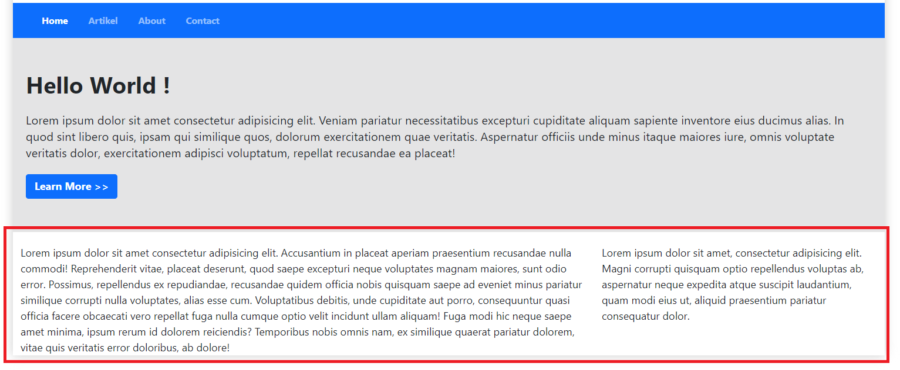
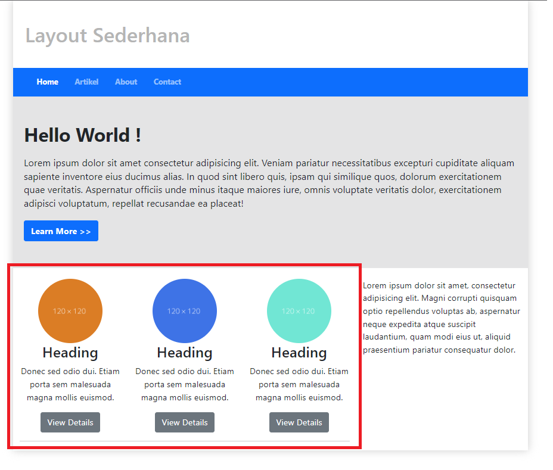
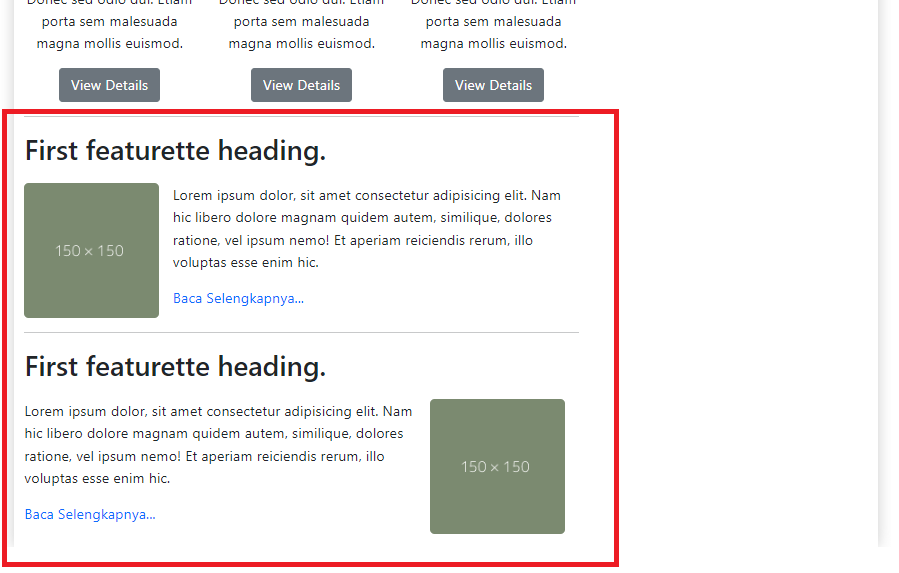

# Praktikum 6 - Pertemuan 7 - Pemrograman Web

<hr>

| Nama | Febro Herdyanto |
| --- | --- |
| NIM | 312010043 |
| Kelas | TI.20.B.1 |
| Mata Kuliah | Pemrograman Web |
| Dosen | Agung Nugroho,S.Kom.,M.Kom |

<hr>

## `Uraian Tugas Membuat Layout Menggunakan Twitter Bootstrap`

Pada kesempatan kali ini (Perkuliahan Pemrograman Web Pertemuan 7), mahasiswa ditugaskan untuk membuat sebuah layout seperti pada Pertemuan 5 lalu, tetapi membuat dengan menggunakan Twitter Bootstrap. Dimana Website tersebut bisa menjadi responsive atau mengikuti semua device yang dipakai oleh user.

### **Membuat Header dan Hero**

Untuk langkah pertama, saya akan membuat halaman baru dengan nama *index.html* dimana didalam file tersebut sudah saya masukkan file Bootstrap dan Javascript yang ada. Beberapa code yang saya buat adalah menggunakan bootstrap primary. Yang artinya, tampilan dari tugas saya tidak sama persis dengan Dosen, tetapi memiliki fungsi yang sama.

Source code yang saya masukkan pada file **index.html** seperti berikut. 

```
<!DOCTYPE html>
<html lang="en">
<head>
    <meta charset="UTF-8">
    <meta http-equiv="X-UA-Compatible" content="IE=edge">
    <meta name="viewport" content="width=device-width, initial-scale=1.0">
    <title>Pertemuan 7</title>
    <link rel="stylesheet" href="assets/css/style.css">
    <link rel="stylesheet" href="assets/css/bootstrap.css">
    <script src="assets/js/bootstrap.bundle.js"></script>
</head>
<body>

<div class="container" style="box-shadow: 0 0 1em #cccccc">
    <div class="row">
        <header>
            <h1>Layout Sederhana</h1>
        </header>
    </div>
    <div class="row">
        <nav class="navbar navbar-collapse navbar-expand navbar-dark bg-primary">
            <div class="container-fluid">
                <div class="collapse navbar-collapse">
                    <ul class="navbar-nav" style="font-size: 14px; font-weight: bold;">
                        <li class="nav-item" style="padding-right: 15px;">
                            <a class="nav-link active" href="#">Home</a>
                        </li>
                        <li class="nav-item" style="padding-right: 15px;">
                            <a class="nav-item">
                                <a href="#" class="nav-link">Artikel</a>
                            </a>
                        </li>
                        <li class="nav-item" style="padding-right: 15px;">
                            <a class="nav-item">
                                <a href="#" class="nav-link">About</a>
                            </a>
                        </li>
                        <li class="nav-item" style="padding-right: 15px;">
                            <a class="nav-item">
                                <a href="#" class="nav-link">Contact</a>
                            </a>
                        </li>
                    </ul>
                </div>
            </div>
        </nav>
    </div>
    <div class="row">
        <section id="hero">
            <h1>Hello World !</h1>
            <p>Lorem ipsum dolor sit amet consectetur adipisicing elit. Veniam pariatur necessitatibus excepturi cupiditate aliquam sapiente inventore eius ducimus alias. In quod sint libero quis, ipsam qui similique quos, dolorum exercitationem quae veritatis. Aspernatur officiis unde minus itaque maiores iure, omnis voluptate veritatis dolor, exercitationem adipisci voluptatum, repellat recusandae ea placeat!</p>
            <a class="btn btn-primary" type="button"><b>Learn More >></b></a>
        </section>
    </div>
</div>

</body>
</html>
```

Hasil dari source code tersebut akan menampilkan output pada browser seperti gambar dibawah ini. <br>


### **Membuat 2 Kolom Berisi Heading dan Widget Header**

Saat ini saya akan membuat baris baru menggunakan `<div class="row">` menjadi 2 bagian. Dimana sisi saya bagi dari 8 kolom dan sisi kanan 4 kolom. <br>
Saya membaginya seperti ini contoh dibawah ini.

```
... //div container
    <div class="row">
        <div class="col col-8">
            Lorem ipsum dolor sit amet consectetur adipisicing elit. Accusantium in placeat aperiam praesentium recusandae nulla commodi! Reprehenderit vitae, placeat deserunt, quod saepe excepturi neque voluptates magnam maiores, sunt odio error. Possimus, repellendus ex repudiandae, recusandae quidem officia nobis quisquam saepe ad eveniet minus pariatur similique corrupti nulla voluptates, alias esse cum. Voluptatibus debitis, unde cupiditate aut porro, consequuntur quasi officia facere obcaecati vero repellat fuga nulla cumque optio velit incidunt ullam aliquam! Fuga modi hic neque saepe amet minima, ipsum rerum id dolorem reiciendis? Temporibus nobis omnis nam, ex similique quaerat pariatur dolorem, vitae quis veritatis error doloribus, ab dolore!
        </div>

        <div class="col col-4">
            Lorem ipsum dolor sit amet, consectetur adipisicing elit. Magni corrupti quisquam optio repellendus voluptas ab, aspernatur neque expedita atque suscipit laudantium, quam modi eius ut, aliquid praesentium pariatur consequatur dolor.
        </div>
    </div>
... // end of container
```

Hasil dari Pembagian tersebut adalah seperti gambar dibawah ini. <br>


<br>

Setelah layout columns yang saya buat sesuai, saya akan memulai memasukkan gambar yang berisi Heading dan tombol. Beberapa source code yang saya tambahkan sebagai berikut. 

```
...
// div class row
        <div class="col col-8">
            <div class="row">
                <div class="col align-middle">
                    
                    <h3 class="text-center">Heading</h3>
                    <p class="text-center">Donec sed odio dui. Etiam porta sem malesuada magna mollis euismod.</p>
                    <center><a href="#" class="btn btn-secondary">View Details</a></center>
                </div>
                <div class="col">
                    
                    <h3 class="text-center">Heading</h3>
                    <p class="text-center">Donec sed odio dui. Etiam porta sem malesuada magna mollis euismod.</p>
                    <center><a href="#" class="btn btn-secondary">View Details</a></center>
                </div>
                <div class="col">
                    
                    <h3 class="text-center">Heading</h3>
                    <p class="text-center">Donec sed odio dui. Etiam porta sem malesuada magna mollis euismod.</p>
                    <center><a href="#" class="btn btn-secondary">View Details</a></center>
                </div>
            </div>
            <hr>
        </div>
// end of div row
...
```

Hasil dari tambahan source code saya adalah seperti gambar dibawah ini. <br>


### **Membuat Konten Artikel**

Kali ini saya akan membuat content article menggunakan bootstrap. dimana setiap artikel yang ditambahkan akan ada foto di sisi kiri dan kanan. Saya akan menambahkan beberapa source code untuk content article.

```
...
// div col 8
            <div class="clearfix entry">
                <h2>First featurette heading.</h2>
                
                <p style="margin-left: 15px;">
                  Lorem ipsum dolor, sit amet consectetur adipisicing elit. Nam hic libero dolore magnam quidem autem, similique, dolores ratione, vel ipsum nemo! Et aperiam reiciendis rerum, illo voluptas esse enim hic.
                  <br> 
                </p>
                <a href="#" class="text-decoration-none">Baca Selengkapnya...</a>
            </div>
            <hr>
            <div class="clearfix entry">
                <h2>First featurette heading.</h2>
                
                <p style="margin-right: 15px;">
                  Lorem ipsum dolor, sit amet consectetur adipisicing elit. Nam hic libero dolore magnam quidem autem, similique, dolores ratione, vel ipsum nemo! Et aperiam reiciendis rerum, illo voluptas esse enim hic.
                  <br> 
                </p>
                <a href="#" class="text-decoration-none">Baca Selengkapnya...</a>
            </div>
// end of div 
...
```

Hasil dari source code tersebut ketika ditampilkan pada browser seperti gambar dibawah ini. <br>


