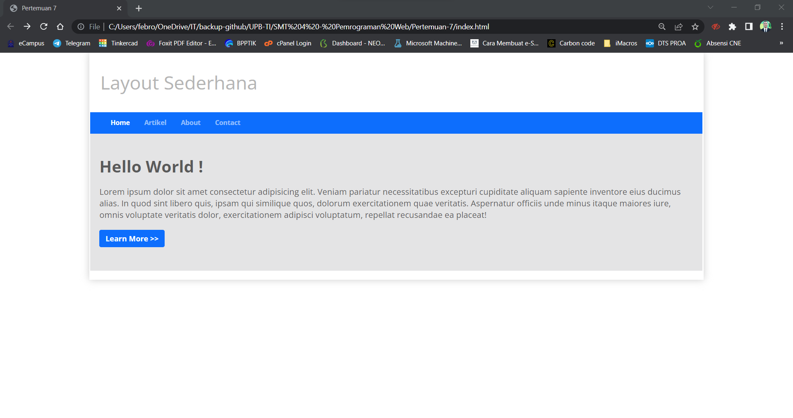

# Praktikum 6 - Pertemuan 7 - Pemrograman Web

<hr>

| Nama | Febro Herdyanto |
| --- | --- |
| NIM | 312010043 |
| Kelas | TI.20.B.1 |
| Mata Kuliah | Pemrograman Web |
| Dosen | Agung Nugroho,S.Kom.,M.Kom |

<hr>

## `Uraian Tugas Membuat Layout Menggunakan Twitter Bootstrap`

Pada kesempatan kali ini (Perkuliahan Pemrograman Web Pertemuan 7), mahasiswa ditugaskan untuk membuat sebuah layout seperti pada Pertemuan 5 lalu, tetapi membuat dengan menggunakan Twitter Bootstrap. Dimana Website tersebut bisa menjadi responsive atau mengikuti semua device yang dipakai oleh user.

### **Membuat Header dan Hero**

Untuk langkah pertama, saya akan membuat halaman baru dengan nama *index.html* dimana didalam file tersebut sudah saya masukkan file Bootstrap dan Javascript yang ada. Beberapa code yang saya buat adalah menggunakan bootstrap primary. Yang artinya, tampilan dari tugas saya tidak sama persis dengan Dosen, tetapi memiliki fungsi yang sama.

Source code yang saya masukkan pada file **index.html** seperti berikut. 

```
<!DOCTYPE html>
<html lang="en">
<head>
    <meta charset="UTF-8">
    <meta http-equiv="X-UA-Compatible" content="IE=edge">
    <meta name="viewport" content="width=device-width, initial-scale=1.0">
    <title>Pertemuan 7</title>
    <link rel="stylesheet" href="assets/css/style.css">
    <link rel="stylesheet" href="assets/css/bootstrap.css">
    <script src="assets/js/bootstrap.bundle.js"></script>
</head>
<body>

<div class="container" style="box-shadow: 0 0 1em #cccccc">
    <div class="row">
        <header>
            <h1>Layout Sederhana</h1>
        </header>
    </div>
    <div class="row">
        <nav class="navbar navbar-collapse navbar-expand navbar-dark bg-primary">
            <div class="container-fluid">
                <div class="collapse navbar-collapse">
                    <ul class="navbar-nav" style="font-size: 14px; font-weight: bold;">
                        <li class="nav-item" style="padding-right: 15px;">
                            <a class="nav-link active" href="#">Home</a>
                        </li>
                        <li class="nav-item" style="padding-right: 15px;">
                            <a class="nav-item">
                                <a href="#" class="nav-link">Artikel</a>
                            </a>
                        </li>
                        <li class="nav-item" style="padding-right: 15px;">
                            <a class="nav-item">
                                <a href="#" class="nav-link">About</a>
                            </a>
                        </li>
                        <li class="nav-item" style="padding-right: 15px;">
                            <a class="nav-item">
                                <a href="#" class="nav-link">Contact</a>
                            </a>
                        </li>
                    </ul>
                </div>
            </div>
        </nav>
    </div>
    <div class="row">
        <section id="hero">
            <h1>Hello World !</h1>
            <p>Lorem ipsum dolor sit amet consectetur adipisicing elit. Veniam pariatur necessitatibus excepturi cupiditate aliquam sapiente inventore eius ducimus alias. In quod sint libero quis, ipsam qui similique quos, dolorum exercitationem quae veritatis. Aspernatur officiis unde minus itaque maiores iure, omnis voluptate veritatis dolor, exercitationem adipisci voluptatum, repellat recusandae ea placeat!</p>
            <a class="btn btn-primary" type="button"><b>Learn More >></b></a>
        </section>
    </div>
</div>

</body>
</html>
```

Hasil dari source code tersebut akan menampilkan output pada browser seperti gambar dibawah ini. <br>


