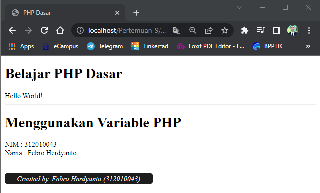

# Praktikum 7 - Pertemuan 9 - Pemrograman Web

<hr>

| Nama | Febro Herdyanto |
| --- | --- |
| NIM | 312010043 |
| Kelas | TI.20.B.1 |
| Mata Kuliah | Pemrograman Web |
| Dosen | Agung Nugroho,S.Kom.,M.Kom |

<hr>

Haloo, saya disini akan membuat tugas menggunakan PHP dengan Web Server Apache2 (XAMPP Application). Mari simak ulasan saya dibawah ini.

### `Instalasi Web Server (XAMPP)`

Saya telah melakukan instalasi Web Server sebelumnya, yaitu XAMPP Application. <br>


<br>

Setelah itu saya akan mencoba menghidupkan Apache pada XAMPP Control Panel. <br>


<br>

Saya akan menjalankan Web Server tersebut pada Web Browser Chrome, dengan mengetikkan [http://localhost/](http://localhost/) atau [http://127.0.0.1/](http://127.0.0.1/) . Maka akan muncul tampilan seperti berikut. <br>


<hr>

Disini saya merubah konfigurasi Documents Root pada XAMPP ke file dimana tugas ini berada. <br>

### `Memulai PHP`

Disini saya akan membuat folder baru dengan nama **lab7_php_dasar** yang diletakkan pada folder **Pertemuan-9** . Berikut adalah tampilannya. <br>
 <br>
Dan akan menampilan seperti dibawah ini pada browser. <br>


### `PHP Dasar / Basic PHP`

Pada point PHP dasar ini saya akan membuat file baru didalam folder *lab7_php_dasar* yaitu **php_dasar.php**. Pada file PHP tersebut saya akan mengisikan file PHP yang berisikan Hello World.

```
<!DOCTYPE html>
<html lang="en">
<head>
    <meta charset="UTF-8">
    <meta http-equiv="X-UA-Compatible" content="IE=edge">
    <meta name="viewport" content="width=device-width, initial-scale=1.0">
    <title>PHP Dasar</title>
</head>
<body>

    <h1>Belajar PHP Dasar</h1>
    
    <?php
        echo "Hello World!";
    ?>

</body>
</html>
```

Berikut adalah tampilan pada web browsernya. <br>


### `Variable PHP`

Setelah belajar menampilkan output menggunakan PHP, kali ini saya membuat variable pada PHP. Untuk variable, PHP menggunakan $ (dolar) untuk mendefinisikan. 

```
    <?php
        $nim = "312010043";
        $nama = "Febro Herdyanto";

        echo "NIM : ".$nim."<br>";
        echo "Nama : $nama";
    ?>
```

Berikut adalah output dari source code diatas. <br>


### `Predefine Variable $_GET`

Pada point predefine variable PHP $_GET disini digunakan untuk mengambil nilai variable yang dikirimkan melalui GET URL. Berikut source code contoh pada predefine variable PHP GET. Saya akan membuat file baru dengan nama **latihan2.php**

```
<!DOCTYPE html>
<html lang="en">
<head>
    <meta charset="UTF-8">
    <meta http-equiv="X-UA-Compatible" content="IE=edge">
    <meta name="viewport" content="width=device-width, initial-scale=1.0">
    <title>Predefine PHP</title>
</head>
<body>
    <h1>Predefine PHP Variable</h1>

    <?php
        echo "Selamat Datang ".$_GET['nama'];
    ?>

    <div> <br> <br> <br>
        <span style="background-color:#1d1d1d; padding:3px; color:#eee; border-radius:5px; "> &nbsp; &nbsp; &nbsp; <i>Created by. Febro Herdyanto (312010043)</i> &nbsp; &nbsp; &nbsp;</span>
    </div>

</body>
</html>
```

Hasil running dari source code diatas adalah seperti berikut. <br>


### `Membuat Form Input`

Point ini akan menjelaskan membuat Form Input menggunaka PHP dan HTML menggunakan method POST. Saya akan membuat file baru dengan nama **form_input.php**

```
<!DOCTYPE html>
<html lang="en">
<head>
    <meta charset="UTF-8">
    <meta http-equiv="X-UA-Compatible" content="IE=edge">
    <meta name="viewport" content="width=device-width, initial-scale=1.0">
    <title>Form Input</title>
</head>
<body>

    <h1>Form Input Using POST Method</h1>

    <form method="POST">
        <label>Nama : </label>
        <input type="text" name="nama">
        <input type="submit" value="Kirim">
    </form>

    <hr>
    <h3 style="color: grey;">Output</h3>
    <?php
        echo "Selamat Datang ".$_POST['nama'];
    ?>

    <div> <br> <br> <br>
        <span style="background-color:#1d1d1d; padding:3px; color:#eee; border-radius:5px; "> &nbsp; &nbsp; &nbsp; <i>Created by. Febro Herdyanto (312010043)</i> &nbsp; &nbsp; &nbsp;</span>
    </div>

</body>
</html>
```

Hasil dari source code tersebut adalah seperti berikut. <br>


### `Operator PHP`

Didalam PHP terdapat operator aritmatika yang dapat digunakan, pada tugas ini saya akan mencoba untuk menggunakan operator aritmatika. Saya membuat file baru dengan nama **operator.php**.

```
<?php
    $gaji = 1000000;
    $pajak = 0.1;
    $thp = $gaji - ($gaji*$pajak);

    echo "Gaji sebelum pajak = Rp. $gaji <br>";
    echo "Gaji yang dibawa pulang = Rp. $thp";
?>
```

Hasil pada operasi aritmatika tersebut adalah sebagai berikut. <br>


### `Kondisi IF`

Disini saya akan membuat file baru dengan nama **kondisiif.php** dengan berisikan source code seperti berikut. Kondisi IF digunakan jika pernyataan untuk mengeksekusi beberapa kode hanya jika kondisi tersebut itu adalah benar. Statement if else dipergunakan untuk mengeksekusi beberapa kondisi jika kondisi benar dan jika kondisi salah.

```
<h2>Kondisi IF</h2>

<?php
    $nama_hari = date("l");

    if ($nama_hari == "Sunday") {
        echo "Minggu";
    } elseif ($nama_hari == "Monday") {
        echo "Senin";
    } else {
        echo "Selasa";
    }
?>

<div> <br> <br>
    <span style="background-color:#1d1d1d; padding:3px; color:#eee; border-radius:5px; "> &nbsp; &nbsp; &nbsp; <i>Created by. Febro Herdyanto (312010043)</i> &nbsp; &nbsp; &nbsp;</span>
</div>
```

Hasil pada source code diatas seperti berikut. <br>


### `Kondisi Switch`

Disini saya membuat file baru dengan nama **switch.php**. Perintah Switch di gunakan untuk memeriksa kebenaran suatu nilai dengan memiliki banyak pemilihan atau nilai pengecekannya. hampir sama dengan penggunaan if else pada php. Source code yang saya tuliskan seperti berikut.

```
<h2>Kondisi Switch</h2>

<?php
    $nama_hari = date("l");
    switch ($nama_hari) {
        case "Sunday":
            echo "Hari Minggu";
            break;
        case "Monday":
            echo "Hari Senin";
            break;
        case "Tuesday":
            echo "Hari Selasa";
            break;
        default:
            echo "Hari Sabtu";
        }
?>

<div> <br> <br>
    <span style="background-color:#1d1d1d; padding:3px; color:#eee; border-radius:5px; "> &nbsp; &nbsp; &nbsp; <i>Created by. Febro Herdyanto (312010043)</i> &nbsp; &nbsp; &nbsp;</span>
</div>
```

Hasil dari source code diatas adalah seperti berikut. <br>


### `Perulangan FOR`

Disini saya akan membuat file baru dengan nama **for.php** dengan source code seperti dibawah ini. <br>
Perulangan for merupakan perulangan yang termasuk dalam couted loop, karena sudah jelas berapa kali ia akan mengulang.

```
<h2>Perulangan FOR</h2>

<?php
    echo "Perulangan 1 sampai 10 <br />";

    for ($i=1; $i<=10; $i++) {
        echo "Perulangan ke: " . $i . '<br />';
    }
    
    echo "<hr>";
    echo "Perulangan Menurun dari 10 ke 1 <br />";
    for ($i=10; $i>=1; $i--) {
        echo "Perulangan ke: " . $i . '<br />';
    }
?>

<div> <br> <br>
    <span style="background-color:#1d1d1d; padding:3px; color:#eee; border-radius:5px; "> &nbsp; &nbsp; &nbsp; <i>Created by. Febro Herdyanto (312010043)</i> &nbsp; &nbsp; &nbsp;</span>
</div>
```

Hasil dari source code diatas adalah sebagai berikut. <br>


### `Perulangan While`

While adalah perintah pada PHP dan bahasa pemrograman lainnya untuk membuat sebuah perulangan yang tidak di ketahui berapa kali perulangan tersebut di lakukan. Saya akan membuat file baru dengan nama **while.php** dengan source code dibawah ini.

```
<h2>Perulangan While</h2>

<?php
    echo "Perulangan 1 sampai 10 <br />";

    $i=1;
        while ($i<=10) {
            echo "Perulangan ke: " . $i . '<br />';
            $i++;
        }
?>

<div> <br> <br>
    <span style="background-color:#1d1d1d; padding:3px; color:#eee; border-radius:5px; "> &nbsp; &nbsp; &nbsp; <i>Created by. Febro Herdyanto (312010043)</i> &nbsp; &nbsp; &nbsp;</span>
</div>
```

Hasil dari source code diatas adalah. <br>


### `Perulangan Do While PHP`

Perulangan do/while akan melakukan perulangan dulu, kemudian memeriksa kondisinya atau sayaratnya. Kalau kondisi terpenuhi, maka do/while akan melanjutkan perulangan. Sebaliknya, dia akan berhenti (break). <br>
Saya akan membuat file baru dengan nama **dowhile.php** dengan source code berikut.

```
<h2>Perulangan Dowhile</h2>

<?php
    echo "Perulangan 1 sampai 10 <br />";

    $i=1;
        do {
            echo "Perulangan ke: " . $i . '<br />';
            $i++;
        } while ($i<=10);
?>

<div> <br> <br>
    <span style="background-color:#1d1d1d; padding:3px; color:#eee; border-radius:5px; "> &nbsp; &nbsp; &nbsp; <i>Created by. Febro Herdyanto (312010043)</i> &nbsp; &nbsp; &nbsp;</span>
</div>
```

Hasil dari source code diatas adalah. <br>


## `Pertanyaan dan Tugas!`

> Buatlah program PHP sederhana dengan menggunakan form input yang menampilkan nama, tanggal lahir dan pekerjaan. Kemudian tampilkan outputnya dengan menghitung umur berdasarkan inputan tanggal lahir. Dan pilihan pekerjaan dengan gaji yang berbeda-beda sesuai pilihan pekerjaan.

## `Jawaban dari Tugas`

> Saya telah membuat 1 file PHP dengan nama **index.php** dimana file tersebut berisi form input data karyawan yang meminta user untuk memasukkan Nama, Tanggal Lahir dan Pekerjaannya. <br> Ketika tombol simpan disimpan, maka akan menghitung umur dan menampilkan Gaji yang diperoleh berdasarkan pekerjaan yang dipilih. Berikut Screenshot yang saya buat.

<br>


<br>

Output ketika disimpan. <br>

